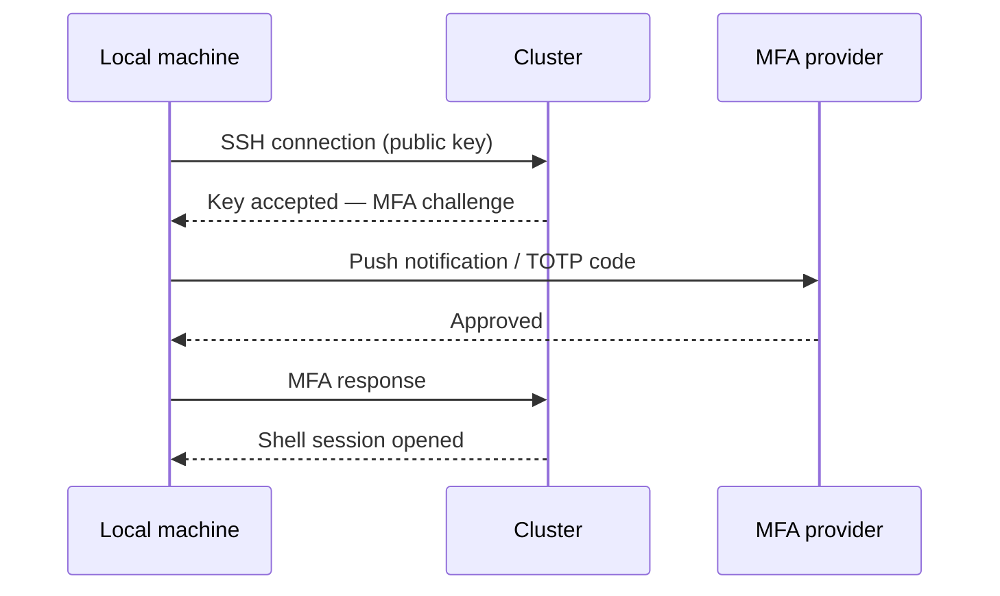
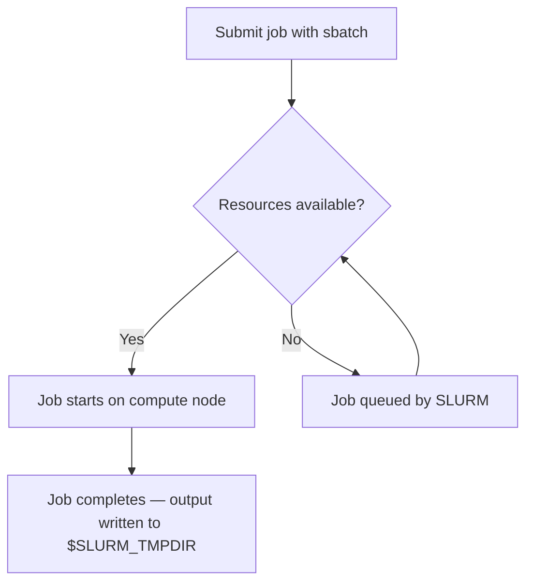
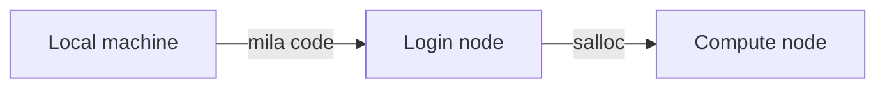

# Guide Template for Mila Documentation

Reference templates and MkDocs Material patterns. Use these when drafting a new guide.

---

## Full Guide Skeleton

````markdown
# <Title: action phrase, e.g. "Set Up SSH Keys" or "Run a Multi-GPU Job">

<One-paragraph introduction. State what the reader will accomplish and why it
matters. Do not use "you" — use imperative mood or third-person.>

## Before you begin

<!-- Pattern A — link to prerequisite pages (use grid cards).
     Add one card per prerequisite page. -->
<div class="grid cards" markdown>

-   [:material-<icon>:{ .lg .middle } __<Prerequisite page title>__](<file>.md)
    { .card }

    ---
    <One-line description of what the prerequisite page covers.>

-   [:material-<icon>:{ .lg .middle } __<Prerequisite page title>__](<file>.md)
    { .card }

    ---
    <One-line description of what the prerequisite page covers.>

</div>

<!-- Pattern B — tool or account requirements not covered in previous guides (use admonition): -->
!!! success "<Tool or account requirements>"
    - <Tool or account requirement> <One-line description of the tool or account requirement.>.

<!-- Both patterns can appear together on the same page. -->

## What this guide covers

* <High-level step 1>
* <High-level step 2>
* <High-level step 3>

---

## <Section 1: first major action>

<Brief context sentence for this section.>

### <Subsection 1a>

<Instruction text.>

```bash
<command>
```
<div class="result" style="border:None; padding:0" markdown>
``` linenums="0"
<expected output>
```
</div>

<Explanation of what the output means, if non-obvious.>

### <Subsection 1b>

<Instruction text with tabs for alternatives:>

=== "Option A"

    ```bash
    <command for option A>
    ```

=== "Option B"

    ```bash
    <command for option B>
    ```

<!-- do not place --- separators between content sections; headings already
     provide visual separation. Reserve --- for the bookend breaks before
     "Key concepts" and "Next step / Next steps", as shown in this template. -->

## <Section 2: second major action>

...

---

<!-- optional — include only when new terms are introduced -->
## Key concepts

`$SLURM_TMPDIR`
:   Fast local scratch storage allocated per job on the compute node.
    Disappears when the job ends.

`sbatch`
:   SLURM command for submitting a batch job script.

---

## Next step / Next steps

<!-- Use "Next step" (singular) for one logical continuation,
     "Next steps" (plural) for multiple paths. Always use grid cards. -->
<div class="grid cards" markdown>

-   [:material-<icon>:{ .lg .middle } __<Next guide title>__](<file>.md)
    { .card }

    ---
    One-line description of what the next guide covers.

-   [:material-<icon>:{ .lg .middle } __<Next guide title>__](<file>.md)
    { .card }

    ---
    One-line description of what the next guide covers.

</div>
````

---

## Frontmatter

Every page should have YAML frontmatter:

```yaml
---
title: <Page title (used in browser tab and search)>
description: <One sentence describing the page (used in search previews)>
---
```

---

## Common MkDocs Material Patterns

### Admonitions

```markdown
!!! note "Title (optional)"
    Content here. Indented 4 spaces.

!!! warning "Title"
    For important warnings that could cause data loss or unexpected behavior.

!!! tip "Title"
    For helpful shortcuts or best practices.

!!! important "Title"
    For critical information the reader must not miss.

??? tip "Collapsible tip"
    Collapsed by default. Good for optional/advanced content.

???+ warning "Windows users: WSL required"
    Open by default. Use for platform-specific variations.
    All commands must be run inside a WSL terminal.
```

### Code blocks

````markdown
```bash
sbatch job.sh
```

```python title="main.py"
import torch
print(torch.cuda.is_available())
```

```console
$ squeue --me
```
````

### Expected output block

```markdown
<div class="result" style="border:None; padding:0" markdown>
``` linenums="0"
Submitted batch job 1234567
```
</div>
```

### Annotations (already enabled)

````markdown
```bash
sbatch --gres=gpu:1 --cpus-per-task=4 job.sh  # (1)!
```
{ .annotate }

1.  `--gres=gpu:1` requests one GPU. Increase the number for multi-GPU jobs.
````

### Tooltips for inline terms (already enabled)

```markdown
The job runs on a [compute node][compute-node].
[compute-node]: #key-concepts "A cluster node with GPUs allocated via SLURM"
```

Or add site-wide abbreviations to `includes/abbreviations.md`.

### Definition lists (for Key concepts sections)

Use code-formatted terms (backticks) for commands, flags, and environment
variables:

```markdown
`$SLURM_TMPDIR`
:   Fast local scratch storage allocated per job on the compute node.
    Disappears when the job ends.

`sbatch`
:   SLURM command for submitting a batch job script.
```

Use bold terms for named options, token types, or labeled concepts (e.g. a
list of authentication methods):

```markdown
**Term 1**
:   Definition text here.
    Continuation on the next line uses the same 4-space indent.

**Term 2**
:   Definition text here.
    Continuation on the next line uses the same 4-space indent.
```

### Mermaid diagrams

Use Mermaid diagrams when a visual makes a multi-step process or system
relationship significantly clearer than prose. Good candidates:

- **Sequence diagrams** — authentication flows, request/response chains,
  multi-party handshakes (e.g. SSH + MFA login)
- **Flowcharts** — decision trees, branching workflows, conditional logic
- **Graph diagrams** — node relationships, data pipelines, cluster topology

**Sequence diagram** — use when showing a back-and-forth between parties
(user ↔ cluster, client ↔ server):

````markdown

````

**Flowchart** — use for decision logic or conditional paths:

````markdown

````

**Graph (left-to-right)** — use for system topology or data flow:

````markdown

````

When **not** to use a diagram: if the flow has fewer than three steps, or if
a numbered list or table communicates the same thing with equal clarity.

### Tabbed content

````markdown
=== "PyTorch"

    ```bash
    pip install torch
    ```

=== "JAX"

    ```bash
    pip install jax[cuda]
    ```
````

### Grid cards (navigation)

<!-- Single card — add &nbsp; to prevent layout issues: -->
```markdown
<div class="grid cards" markdown>

-   [:material-run-fast:{ .lg .middle } __Page Title__](file.md)
    { .card }

    ---
    One-line description of the linked page.

&nbsp;

</div>
```

<!-- Multiple cards: -->
```markdown
<div class="grid cards" markdown>

-   [:material-run-fast:{ .lg .middle } __Page Title__](file.md)
    { .card }

    ---
    One-line description of the linked page.

-   [:material-run-fast:{ .lg .middle } __Page Title__](file.md)
    { .card }

    ---
    One-line description of the linked page.

</div>
```

Common Material icons for guides:
- `:material-run-fast:` — quick start / next step
- `:material-key:` — authentication / SSH
- `:material-server:` — cluster / compute
- `:material-lightning-bolt:` — GPU / performance
- `:material-file-code:` — code / scripts
- `:material-database:` — storage / data
- `:material-shield-check:` — security / MFA
- `:material-monitor:` — monitoring / debugging

### File includes (for code examples from docs/examples/)

````markdown
```python title="main.py"
--8<-- "docs/examples/frameworks/pytorch_setup/main.py"
```
````

---

## Naming Conventions

- Filename: `Userguide_<topic>.md` for user-facing how-to guides
- Filename: `Information_<topic>.md` for reference/informational pages
- Title case for page titles: "Run a Multi-GPU Job"
- Sentence case for section headings: "Create the project directory"
- No numbers in section headings — use descriptive titles only
  (e.g. `### First-time login`, not `### 2. First-time login`)

---

## Writing style rules

### Clarity in lists and alternatives

When a sentence offers two or more alternatives joined by "or" or "and", write
each alternative as a grammatically complete clause. Do not rely on the reader
inferring a verb or subject from the first half.

**Avoid** (implied verb — reader must infer "has been"):
> Ensure the TOTP QR code has been scanned or the Push device enrolled.

**Prefer** (each clause is self-contained):
> Ensure the TOTP QR code has been scanned, or the Push device has been
> enrolled, before ending the first session.

This rule applies especially in warning and important admonitions, where
ambiguity can cause user errors.

---

## Checklist Before Saving

- [ ] YAML frontmatter with `title` and `description`
- [ ] Introduction paragraph (no "you/your")
- [ ] Before you begin section — grid cards (Pattern A) and/or admonition
      (Pattern B) as appropriate
- [ ] "What this guide covers" bullet list
- [ ] All commands in ` ```bash ` blocks
- [ ] Expected output in `<div class="result">` blocks
- [ ] Key concepts section as definition list (only if new terms introduced)
- [ ] Annotations added to non-obvious command flags
- [ ] Mermaid diagram added where helpful — sequence diagram for auth/request
      flows, flowchart for decision logic, graph for topology/pipelines
- [ ] Next step / Next steps grid card (if a logical next guide exists)
- [ ] Tone rules applied (no "you", active voice, present tense, no vague words)
- [ ] Parallel alternatives are grammatically complete (no implied-verb ellipsis)
- [ ] Consistent Mila terminology (`cluster`, `compute node`, `SLURM`, etc.)
- [ ] No numbered headings (remove any `1.`, `2.`, etc. prefixes from titles)
- [ ] Line width ≤ 80 characters (per CONTRIBUTING.md)
