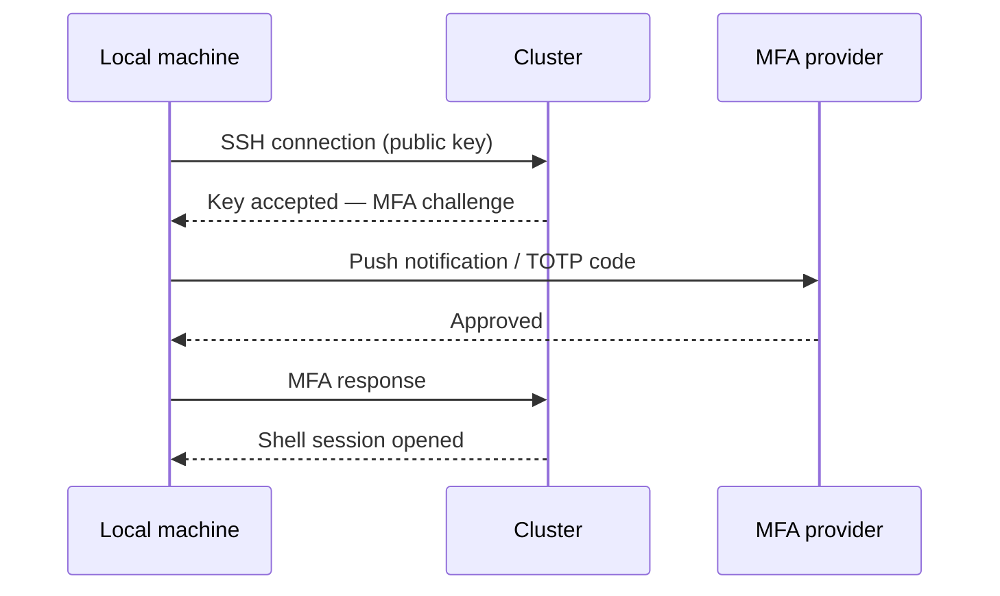
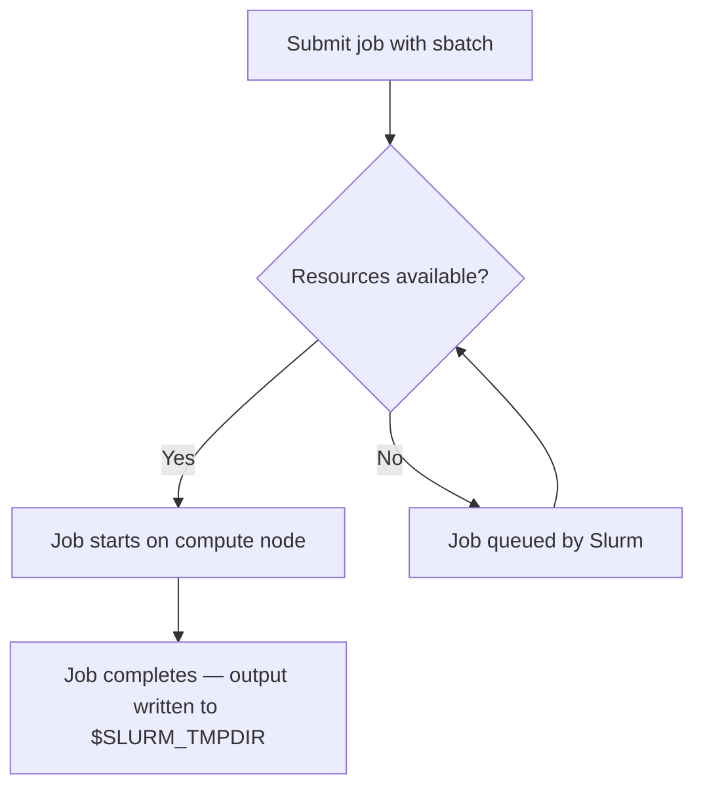
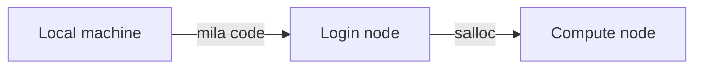

# Shared MkDocs Material Patterns for Mila Documentation

Shared reference for all `miladocs-*` skills. Covers frontmatter, MkDocs
Material patterns, and naming conventions that apply to every documentation
page.

---

## Frontmatter

Every page must have YAML frontmatter:

```yaml
---
title: <Page title (used in browser tab and search)>
description: <One sentence describing the page (used in search previews)>
---
```

---

## Common MkDocs Material Patterns

### Admonitions

```markdown
!!! note "Title (optional)"
    Indented 4 spaces. For context or supplementary information the reader
    should be aware of.

!!! warning "Title"
    For important warnings that could cause data loss, unexpected behavior, or
    breaking something.

!!! tip "Title"
    For helpful shortcut, best practice, or time-saving suggestion.

!!! important "Title"
    For critical information the reader must not miss.

!!! success "Title"
    For tool or account prerequisites the reader must have before starting.

??? question "Title"
    For anticipated reader questions: troubleshooting scenarios or conceptual
    FAQs that interrupt the main flow.

??? tip "Collapsible tip"
    Collapsed by default. Good for optional or advanced content that would
    clutter the main flow.

???+ warning "Windows users: WSL required"
    Open by default. Use for platform-specific variations or alternatives.
```

### Code blocks

````markdown
```bash
sbatch job.sh
```

```python title="main.py"
import torch
print(torch.cuda.is_available())
```

```console
$ squeue --me
```
````

### Expected output block

```markdown
<div class="result" style="border:None; padding:0" markdown>
``` linenums="0"
Submitted batch job 1234567
```
</div>
```

### Annotations

````markdown
```bash
sbatch --gres=gpu:1 --cpus-per-task=4 job.sh  # (1)!
```
{ .annotate }

1.  `--gres=gpu:1` requests one GPU. Increase the number for multi-GPU jobs.
````

### Tooltips for inline terms

```markdown
The job runs on a [compute node][compute-node].
[compute-node]: #key-concepts "A cluster node with GPUs allocated via Slurm"
```

Or add site-wide abbreviations to `includes/abbreviations.md`.

### Definition lists (for Key concepts sections)

Use code-formatted terms (backticks) for commands, flags, and environment
variables:

```markdown
`$SLURM_TMPDIR`
:   Fast local scratch storage allocated per job on the compute node.
    Disappears when the job ends.

`sbatch`
:   Slurm command for submitting a batch job script.
```

Use bold terms for named options, token types, or labeled concepts (e.g. a
list of authentication methods):

```markdown
**Term 1**
:   Definition text here.
    Continuation on the next line uses the same 4-space indent.

**Term 2**
:   Definition text here.
    Continuation on the next line uses the same 4-space indent.
```

### Mermaid diagrams

Use Mermaid diagrams when a visual makes a multi-step process or system
relationship significantly clearer than prose. Good candidates:

- **Sequence diagrams** — authentication flows, request/response chains,
  multi-party handshakes (e.g. SSH + MFA login)
- **Flowcharts** — decision trees, branching workflows, conditional logic
- **Graph diagrams** — node relationships, data pipelines, cluster topology

**Sequence diagram** — use when showing a back-and-forth between parties
(user ↔ cluster, client ↔ server):

````markdown

````

**Flowchart** — use for decision logic or conditional paths:

````markdown

````

**Graph (left-to-right)** — use for system topology or data flow:

````markdown

````

When **not** to use a diagram: if the flow has fewer than three steps, or if
a numbered list or table communicates the same thing with equal clarity.

### Tabbed content

````markdown
=== "PyTorch"

    ```bash
    pip install torch
    ```

=== "JAX"

    ```bash
    pip install jax[cuda]
    ```
````

### Grid cards (navigation)

<!-- Single card — add &nbsp; to prevent layout issues: -->
```markdown
<div class="grid cards" markdown>

-   [:material-run-fast:{ .lg .middle } __Page Title__](file.md)
    { .card }

    ---
    One-line description of the linked page.

&nbsp;

</div>
```

<!-- Multiple cards: -->
```markdown
<div class="grid cards" markdown>

-   [:material-run-fast:{ .lg .middle } __Page Title__](file.md)
    { .card }

    ---
    One-line description of the linked page.

-   [:material-run-fast:{ .lg .middle } __Page Title__](file.md)
    { .card }

    ---
    One-line description of the linked page.

</div>
```

Common Material icons for guides:
- `:material-run-fast:` — quick start / next step
- `:material-key:` — authentication / SSH
- `:material-server:` — cluster / compute
- `:material-lightning-bolt:` — GPU / performance
- `:material-file-code:` — code / scripts
- `:material-database:` — storage / data
- `:material-shield-check:` — security / MFA
- `:material-monitor:` — monitoring / debugging

### File includes (for code examples from docs/examples/)

````markdown
```python title="main.py"
--8<-- "docs/examples/frameworks/pytorch_setup/main.py"
```
````

### Content includes (include-markdown)

Use `include-markdown` to reuse prose content from another documentation page
without duplicating it. This is appropriate when a section of text belongs to
multiple pages.

Use **single-line syntax** when only `start` is needed (the common case):

```markdown

```

Use **multi-line syntax** (2-space indent) when adding parameters beyond
`start`:

```markdown

```

- `start="<!-- START -->"` is **always required** — it skips the included file's
  frontmatter, starting inclusion from the `<!-- START -->` marker.
- The included file **must** contain a `<!-- START -->` HTML comment at the
  point where inclusion should begin.

**In the included file:**

```markdown
---
title: Title
description: Page description.
---

<!-- START -->
# Title

...
```
