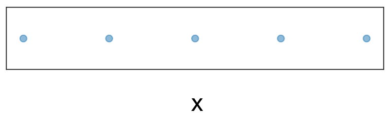
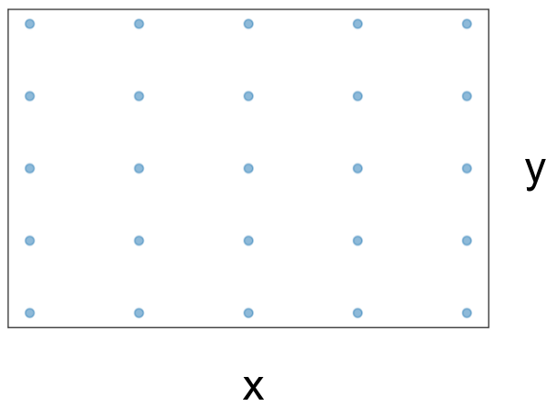
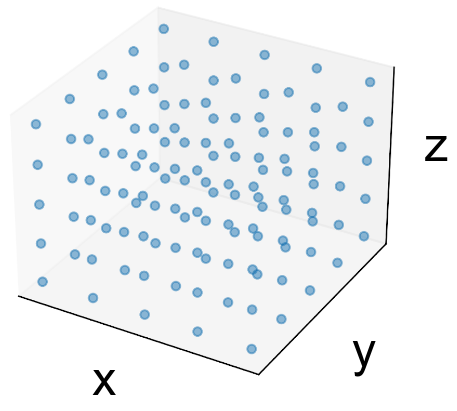
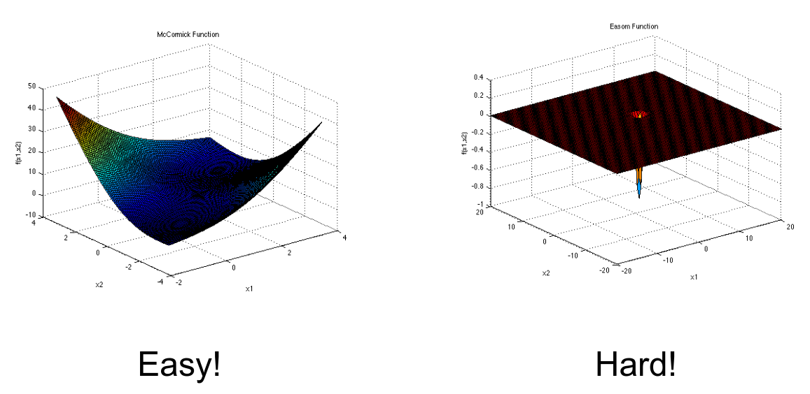
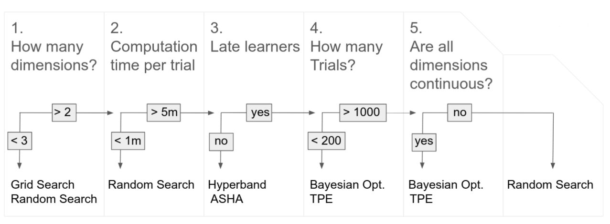
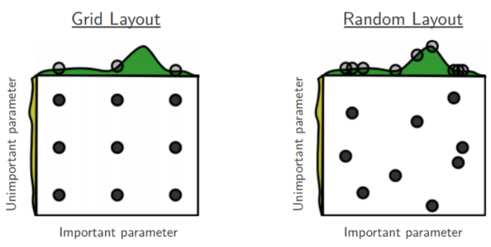
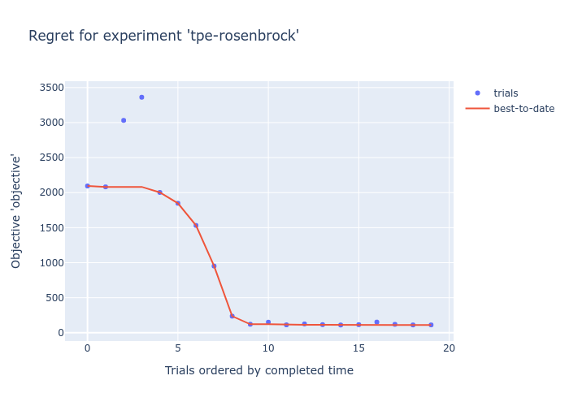
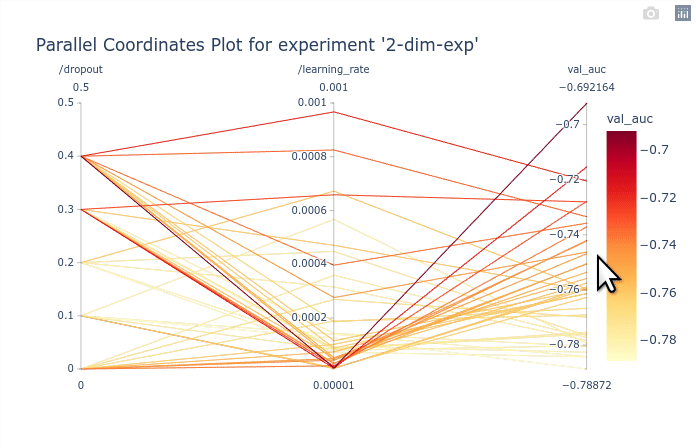
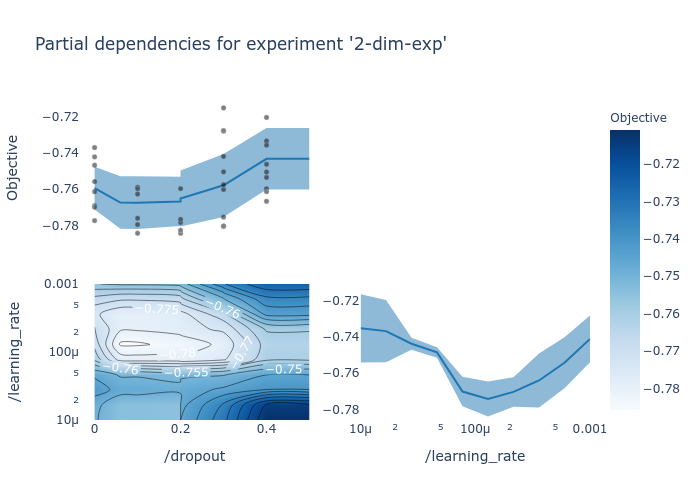

Hyperparameter Optimization
===========================

Why it matters
--------------

RL paper
Are GANs created equal? a large-scale study. Lucic et al (2017)
On the state of the art of evaluation in neural language models. Melis et al (2017)
Knowledge Base Completion: Baselines Strike Back. Kadlec et al (2017)
Repro paper
Accounting for variance in ML Benchmarks
Optimizer benchmark (DeepOBS?)

Survey

Defining the search space
-------------------------

- Avoid turning discrete values into categories
- Use logarithmic distribution if the effect of hyperparameter on the objective is logarithmic (ex:
learning rates)
- Inverse logarithmic for hyperparameters behaving the other way around (ex: gamma of exponential learning rate schedule) (todo: get back equation from slides)

Learning-rate
^^^^^^^^^^^^^

Learning-rate schedule
^^^^^^^^^^^^^^^^^^^^^^

Momentum
^^^^^^^^

Weight decay
^^^^^^^^^^^^

Mini-batch size
^^^^^^^^^^^^^^^

Size of layers
^^^^^^^^^^^^^^

Number of layers
^^^^^^^^^^^^^^^^

Choosing the budget
-------------------

Selecting HPO algorithms
------------------------

How many dimensions?
^^^^^^^^^^^^^^^^^^^^

Computational time per trial
^^^^^^^^^^^^^^^^^^^^^^^^^^^^

Late learners
^^^^^^^^^^^^^

How many trials?
^^^^^^^^^^^^^^^^

Are all dimensions continuous?
^^^^^^^^^^^^^^^^^^^^^^^^^^^^^^

Visualizations
--------------

Frameworks
----------

Oríon
^^^^^

- Developped at Mila

Ray-Tune
^^^^^^^^

- Advantage if using Ray
- Many algorithms

Optuna
^^^^^^

- Good TPE implementation
- Less algorithms

References
----------
AutoML book
