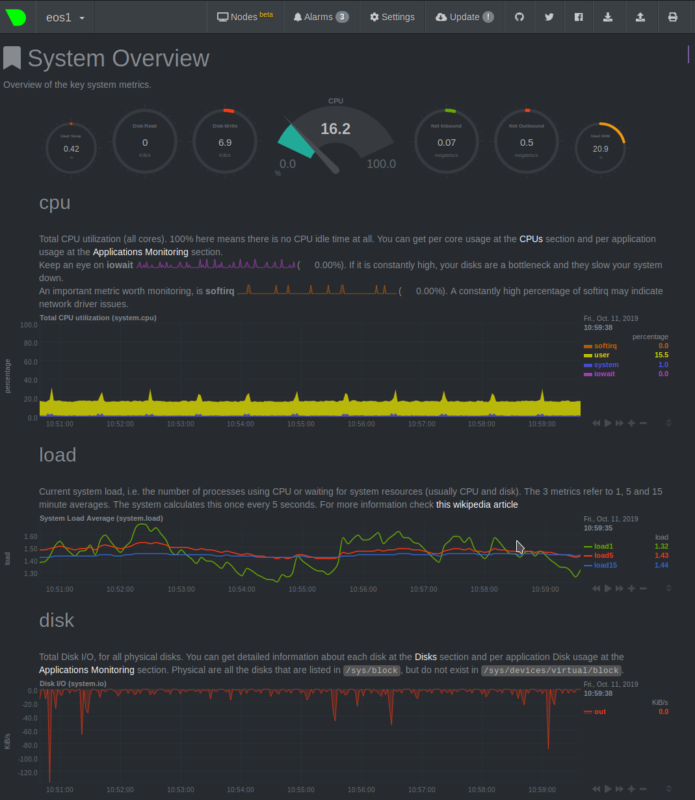
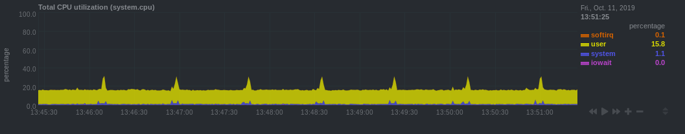
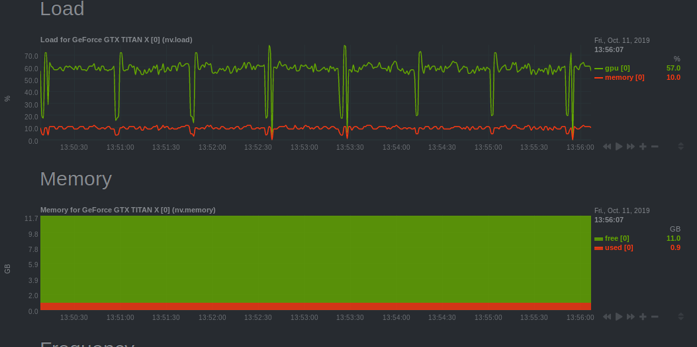
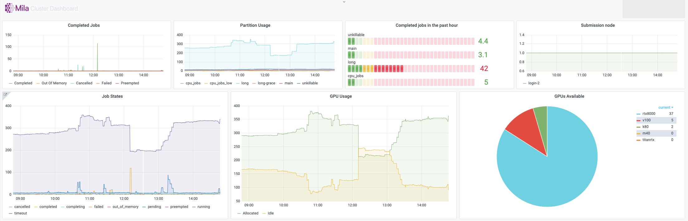

Monitoring
==========

Every compute node on the Mila cluster has a `Netdata <https://www.netdata.cloud/>`_
monitoring daemon allowing you to get a sense of the state of the node.
This information is exposed in two ways:

* For every node, there is a web interface from Netdata itself at ``<node>.server.mila.quebec:19999``.
  This is accessible only when using the Mila wifi or through SSH tunnelling.

  * SSH tunnelling: on your local machine, run

    * ``ssh -L 19999:<node>.server.mila.quebec:19999 -p 2222
      login.server.mila.quebec``
    * or ``ssh -L 19999:<node>.server.mila.quebec:19999 mila`` if you have
      already setup your :ref:`SSH Login`,
  * then open http://localhost:19999 in your browser.
* The Mila dashboard at `dashboard.server.mila.quebec <https://dashboard.server.mila.quebec/>`_
  exposes aggregated statistics with the use of `grafana <https://grafana.com/>`_.
  These are collected internally to an instance of `prometheus <https://prometheus.io/>`_.

In both cases, those graphs are not editable by individual users,
but they provide valuable insight into the state of the whole cluster
or the individual nodes.
One of the important uses is to collect data about the health
of the Mila cluster and to sound the alarm if outages occur
(e.g. if the nodes crash or if GPUs mysteriously become unavailable for SLURM).


Example with Netdata on cn-c001
-------------------------------

For example, if we have a job running on ``cn-c001``, we can type
``cn-c001.server.mila.quebec:19999`` in a browser address bar and the following
page will appear.




Example watching the CPU/RAM/GPU usage
--------------------------------------

Given that compute nodes are generally shared
with other users who are also running jobs at the same time and
consuming resources, this is not generally a good way to profile your code
in fine details.
However, it can still be a very useful source of information
for getting an idea of whether the machine that you requested is being
used in its full capacity.

Given how expensive the GPUs are, it generally makes sense to try to
make sure that this resources is always kept busy.

* CPU
    * iowait (pink line): High values means your model is waiting on IO a lot (disk or network).



* CPU RAM
    * You can see how much CPU RAM is being used by your script in practice,
      considering the amount that you requested (e.g. ```sbatch --mem=8G ...```).
    * GPU usage is generally more important to monitor than CPU RAM.
      You should not cut it so close to the limit that your experiments randomly fail
      because they run out of RAM. However, you should not request blindly 32GB of RAM
      when you actually require only 8GB.

.. image:: monitoring_ram.png
    :align: center
    :alt: monitoring_ram.png

* GPU
    * Monitors the GPU usage using an `nvidia-smi plugin for Netdata <https://learn.netdata.cloud/docs/agent/collectors/python.d.plugin/nvidia_smi/>`_.
    * Under the plugin interface, select the GPU number which was allocated to
      you. You can figure this out by running ``echo $SLURM_JOB_GPUS`` on the
      allocated node or, if you have the job ID,
      ``scontrol show -d job YOUR_JOB_ID | grep 'GRES'`` and checking ``IDX``
    * You should make sure you use the GPUs to their fullest capacity.
    * Select the biggest batch size if possible to increase GPU memory usage and
      the GPU computational load.
    * Spawn multiple experiments if you can fit many on a single GPU.
      Running 10 independent MNIST experiments on a single GPU will probably take
      less than 10x the time to run a single one. This assumes that you have more
      experiments to run, because nothing is gained by gratuitously running experiments.
    * You can request a less powerful GPU and leave the more powerful GPUs
      to other researchers who have experiments that can make best use of them.
      Sometimes you really just need a k80 and not a v100.



* Other users or jobs
    * If the node seems unresponsive or slow,
      it may be useful to check what other tasks are
      running at the same time on that node.
      This should not be an issue in general,
      but in practice it is useful to be able to
      inspect this to diagnose certain problems.

.. image:: monitoring_users.png
    :align: center
    :alt: monitoring_users.png


Example with Mila dashboard
---------------------------


