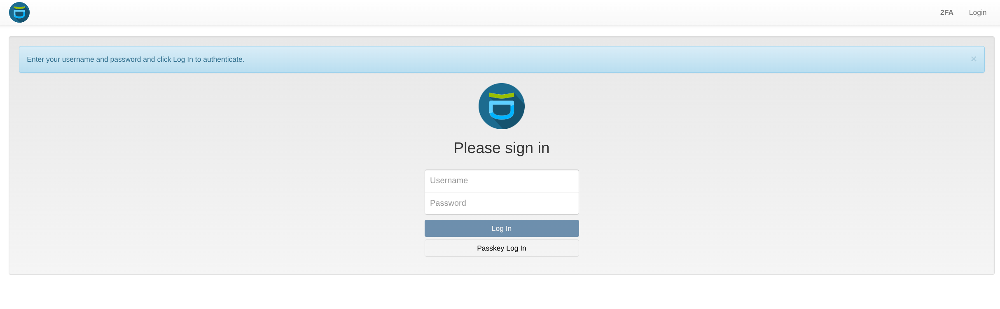
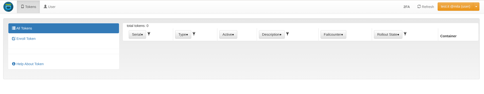
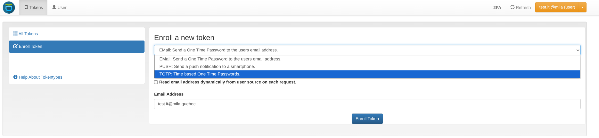
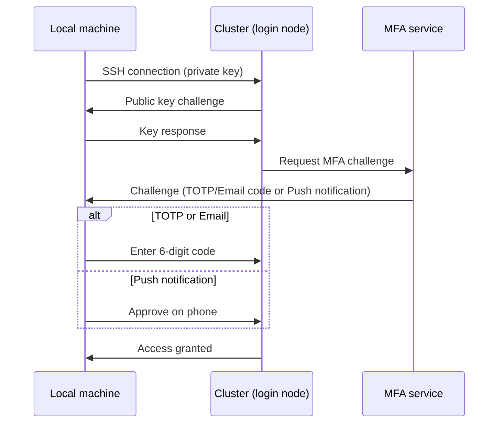

# Set Up Multi-Factor Authentication

Multi-Factor Authentication (MFA) adds a security layer beyond SSH keys.
After setup, every cluster login requires two distinct factors: an SSH
public key (first factor) and a dynamic verification code (second
factor). This guide covers how to register for MFA, choose an
authentication method, and complete a cluster login.

## Before you begin

-   [:material-server:{ .lg .middle } __Cluster Access__](Userguide_cluster_access.md)
    { .card }

    ---
    Obtain a Mila account and complete onboarding before setting up MFA.

&nbsp;

## What this guide covers

* Choose a second-factor authentication method
* Register on the MFA web portal using an email registration token
* Understand which token to use for the portal vs. SSH cluster logins
* Complete a cluster login after MFA is active

---

## Authentication methods

Choose one of the following methods for second-factor verification.

**PrivacyIDEA Push notification**
:   Approve a login request via a push notification on a smartphone.
    Requires the **privacyIDEA Authenticator** app (iOS or Android).

**TOTP (Time-based One-Time Password)**
:   Enter a 6-digit rolling code from an authenticator app. Compatible
    with **privacyIDEA**, Google Authenticator, Microsoft Authenticator,
    or any app supporting the RFC 6238 standard.

**Email token**
:   Receive a one-time verification code at the registered
    **@mila.quebec** email address.

**Hardware token (coming soon)**
:   YubiKey support (FIDO2/WebAuthn) is planned for a future update.

## Register on the MFA portal

To configure MFA factors (TOTP, Push, or email), access the MFA web
portal at [mfa.mila.quebec](https://mfa.mila.quebec).

### Receive the registration token

Before the first login, an automated email arrives containing a
**Registration Token**.

!!! important "Use the registration token immediately"
    The registration token is a one-time code — it expires after first
    use. Complete the full setup in a single session.

### First-time login

1. Navigate to [mfa.mila.quebec](https://mfa.mila.quebec).

    

2. Enter the cluster username in the **Username** field.

3. Enter the **Registration Token** from the email in the
   **Password** field.

    

4. Immediately enroll a permanent factor (TOTP or Push) before
   ending the session.

    

!!! warning "Enroll a permanent factor before ending the first session"
    The MFA portal accepts email-token login during the first session
    only. All subsequent portal logins require a **TOTP token**. If
    the TOTP QR code has not been scanned, or the Push device has not
    been enrolled, before the session ends, contact
    [IT Support](https://it-support.mila.quebec) to obtain a new
    registration token.

### Subsequent logins to the portal

After the first session, the portal accepts **TOTP tokens only**.
Email tokens can no longer be used to access the portal — they remain
valid only for SSH cluster logins.

### Which token to use

| Access type    | First login                | Every subsequent login |
| -------------- | -------------------------- | ---------------------- |
| MFA web portal | Email registration token   | TOTP token only        |
| Cluster SSH    | N/A                        | TOTP, Push, or email   |

## How SSH authentication works

When connecting to the cluster via SSH, authentication proceeds in
three steps:

1. **Key exchange** — the local machine presents its private key to
   match the public key stored on the cluster.
2. **MFA challenge** — once the key is accepted, the cluster prompts
   for the second factor.
3. **Validation** — for Push, tap "Approve" on the phone; for TOTP
   or email, type the code into the terminal prompt.

## Tips for day-to-day use

!!! tip "Enroll two factors for redundancy"
    Enroll at least two factors (e.g., both Push and TOTP) to maintain
    access if a phone is lost or has no internet connection.

!!! tip "Reduce MFA prompts with SSH connection multiplexing"
    Adding `ControlMaster=auto` and `ControlPersist=yes` to the Mila
    SSH config entry allows MFA verification once per machine boot
    rather than once per SSH command. This is supported on Linux and
    macOS. Windows users should install WSL to use these SSH options.

## Troubleshooting

**TOTP codes rejected**
:   TOTP codes are time-sensitive. Set the smartphone clock to
    automatic time synchronization to keep codes valid.

**Lost phone or device**
:   Contact [IT Support](https://it-support.mila.quebec) immediately
    to reset MFA tokens.

---

## Next step

-   [:material-run-fast:{ .lg .middle } __Log in to the cluster__](Userguide_login.md)
    { .card }

    ---
    Connect to the Mila cluster via SSH with MFA configured.

&nbsp;

