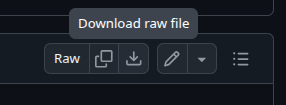
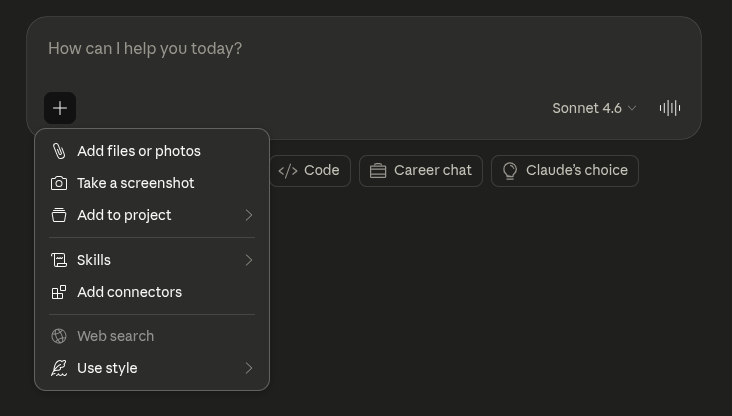
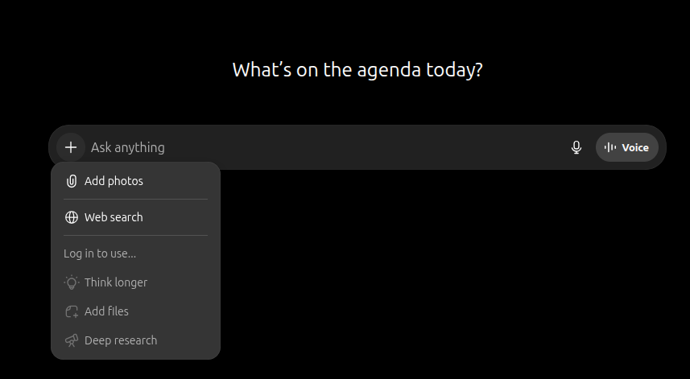
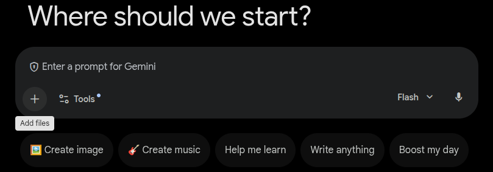

# Add Mila Docs context to AI assistants

[`all_docs_condensed.md`](https://github.com/mila-iqia/mila-docs/blob/master/all_docs_condensed.md) is a single-file distillation of the full Mila
cluster documentation — covering cluster access, Slurm, storage, GPU
selection, Python environments, experiment tracking, and more. Providing
this file to any LLM chat assistant gives that assistant an accurate,
Mila-specific knowledge base, making it possible to resolve cluster
issues on the spot without manually searching the documentation.

## Before you begin

!!! success "Requirements"
    - An account with at least one LLM chat assistant:
    [Claude](https://claude.ai), [ChatGPT](https://chatgpt.com), or
    [Gemini](https://gemini.google.com) for instance.

## What this guide covers

* Download the condensed reference file
* Load the file into a chat LLM session
* Phrase effective queries for accurate answers
* Interpret and validate the assistant's responses

---

## Download the condensed reference

`all_docs_condensed.md` is published at the root of the
[mila-docs repository](https://github.com/mila-iqia/mila-docs). Download
it once and keep it locally — it covers all major cluster topics and fits
within the context window of all current major LLMs.

Download with `curl`:

```bash
curl -LO https://raw.githubusercontent.com/mila-iqia/mila-docs/master/all_docs_condensed.md
```

Or download manually on GitHub:

1. Open the
    [mila-docs repository](https://github.com/mila-iqia/mila-docs).
2. Click [`all_docs_condensed.md`](https://github.com/mila-iqia/mila-docs/blob/master/all_docs_condensed.md) in the file list.
3. Click the **Download raw file** button, on the upper right corner of the file.

    

## Load the file into a chat session

Most LLM chat assistants accept either file uploads or large text pastes.

=== "Claude (claude.ai)"

    1. Open a new conversation at [claude.ai](https://claude.ai).
    2. Click the **paperclip** icon.
        

    3. Select `all_docs_condensed.md` from the local filesystem.
    4. Add a context message alongside the file upload:

        ```
        This file is the Mila cluster documentation condensed into a
        single reference. Use it to answer my questions about the
        Mila cluster.
        ```

    5. Ask the first question in the same message or as a follow-up.

=== "ChatGPT"

    1. Open a new conversation at [chatgpt.com](https://chatgpt.com)
        using GPT-4o or a later model.
    2. Click the **paperclip** icon.
        
    3. Select `all_docs_condensed.md` from the local filesystem.
    4. Add a context message alongside the upload:

        ```
        The attached file is the Mila cluster documentation condensed
        into a single reference. Use it to answer my questions about
        the Mila cluster.
        ```

    5. Ask the first question in the same message or as a follow-up.

=== "Gemini"

    1. Open a new conversation at [gemini.google.com](https://gemini.google.com).
    2. Click the **attachment** icon.
        
    3. Select `all_docs_condensed.md` from the local filesystem.
    4. Add a context message alongside the upload:

        ```
        The attached file is the Mila cluster documentation condensed
        into a single reference. Use it to answer my questions about
        the Mila cluster.
        ```

    5. Ask the first question in the same message or as a follow-up.

=== "No file upload available"

    If the assistant does not support file uploads, paste the full
    content of `all_docs_condensed.md` directly into the message.
    The file is approximately 1 000 lines and fits within the context
    window of all major LLMs.

    Paste into the message field and add the context instructions
    below before asking a question.

    ```
    The attached file is the Mila cluster documentation condensed
    into a single reference. Use it to answer my questions about
    the Mila cluster.
    ```

## Phrase effective queries

Queries that name the specific topic — Slurm commands, partition names,
storage paths, or tool names — produce the most accurate responses.

| Goal | Example query |
|------|---------------|
| Look up a command | `What does the savail command do?` |
| Understand a partition | `What are the resource limits for the unkillable partition?` |
| Troubleshoot an error | `My job is stuck in PD state — what does that mean?` |
| Get setup steps | `How do I set up MFA for the Mila cluster?` |
| Compare options | `When should I use salloc instead of sbatch?` |
| Check storage policies | `What is the difference between $SCRATCH and $HOME?` |

!!! tip
    Include the word **Mila** or **cluster** in each query to help the
    assistant scope its answer to the provided file rather than drawing
    on general, potentially inaccurate knowledge.

## Interpret and validate responses

LLM assistants can occasionally produce responses that look plausible but
contain errors — especially for commands with many optional flags or for
policies that change over time.

Apply these checks after any response:

- **Verify command flags**: run `man <command>` or `<command> --help` on
a login node to confirm flag names and syntax.
- **Check current partition limits**: limits can change — verify with
`sinfo`.
- **Confirm storage paths**: quota policies and storage layout are
sometimes updated between condensed-file releases.

---

## Key concepts

`all_docs_condensed.md`
:   A single-file distillation of the full Mila technical documentation,
    designed to fit within the context window of any modern LLM assistant.
    Covers cluster access, Slurm, storage, Python environments,
    distributed training, and FAQ.

Context window
:   The maximum amount of text an LLM processes in a single session.
    Modern assistants support windows
    large enough to hold the entire condensed file.

Context message
:   An instruction given at the start of a session that tells the
    assistant how to interpret the provided material. Including a clear
    context message improves response accuracy.


</div>
