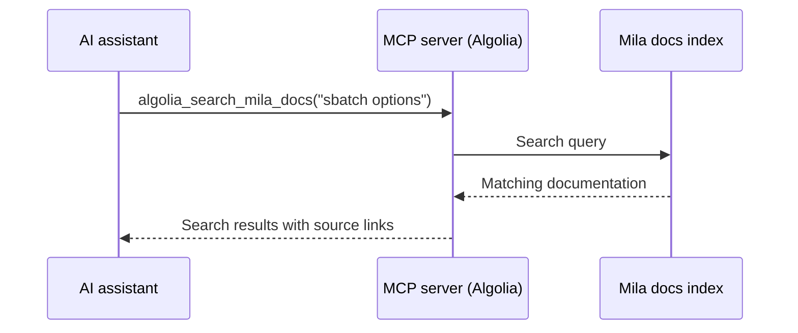

# Mila-Aware AI Assistance with MCP

The Model Context Protocol (MCP) is an open standard that lets AI assistants
connect to external knowledge sources as callable tools. Configuring the Mila
Docs MCP server gives Claude Code or Cursor access to the full Mila
documentation index — so when a question touches cluster commands, Slurm syntax,
storage policies, or account setup, the assistant can pull in accurate,
up-to-date Mila guidance automatically, without requiring a separate search.

## Before you begin

<div class="grid cards" markdown>

-   [:material-robot:{ .lg .middle } __Set Up Claude Code__](claude_code.md)
    { .card }

    ---
    Install Claude Code and extend it with skills from a marketplace.

&nbsp;

</div>

## What this guide covers

* Understand what MCP is and how the Mila Docs MCP server works
* Configure the Mila Docs MCP server
* See an example of the assistant using Mila context to answer a question

---

## What is MCP?

MCP (Model Context Protocol) is an open standard that defines how AI tools
communicate with external services. An MCP **server** exposes one or more tools
— actions the AI can invoke, such as searching a database or fetching a web
page. The AI tool (Claude Code, Cursor) acts as the MCP **client**: it discovers
available tools on startup, then calls them automatically when a query requires
external data.



## The Mila Docs MCP server

The Mila documentation site is indexed by
[DocSearch](https://docsearch.algolia.com/) made by Algolia and exposes a public
MCP server at the following endpoint:

```
https://558773LESW.algolia.net/mcp/1/3_N8rKyLQhaxUEpt0FMx6A/mcp
```

The server exposes a search tool that accepts natural-language queries and
returns matching sections of the Mila documentation. The Search API key is
embedded in the URL — no additional authentication is required.

## Configure in Claude Code

=== "CLI (recommended)"

    Run the following command to register the Mila Docs MCP server:

    ```bash
    claude mcp add --transport http mila-docs \
        https://558773LESW.algolia.net/mcp/1/3_N8rKyLQhaxUEpt0FMx6A/mcp
    ```
    <div class="result" style="border:None; padding:0" markdown>
    ``` linenums="0"
    Added HTTP MCP server mila-docs with URL: https://558773LESW.algolia.net/mcp/1/3_N8rKyLQhaxUEpt0FMx6A/mcp to local config
    File modified: /Users/username/.claude.json [project: /Users/username/CODE/mila-docs]
    ```
    </div>

    The server is registered globally and becomes available in all Claude Code
    sessions.

    !!! tip
        Add `--scope project` to limit the server to the current
        project only.

=== "Config file"

    Add the server entry to `~/.claude.json` (global) or `.claude/settings.json`
    (project-level):

    ```json
    {
      "mcpServers": {
        "mila-docs": {
          "type": "http",
          "url": "https://558773LESW.algolia.net/mcp/1/3_N8rKyLQhaxUEpt0FMx6A/mcp"
        }
      }
    }
    ```

    Restart Claude Code after saving the file.

## Configure in Cursor

Cursor reads MCP configuration from a JSON file. Create or edit the file at one
of the following paths:

| Scope | File |
|-------|------|
| Global (all projects) | `~/.cursor/mcp.json` |
| Project only | `.cursor/mcp.json` (project root) |

Add the following entry:

```json
{
  "mcpServers": {
    "mila-docs": {
      "url": "https://558773LESW.algolia.net/mcp/1/3_N8rKyLQhaxUEpt0FMx6A/mcp"
    }
  }
}
```

After saving, open **Cursor Settings → MCP** and confirm that `mila-docs` shows
a green status indicator.

## Ask the assistant about Mila

Once the MCP server is configured, the AI assistant can answer questions about
Mila systems accurately — drawing on the documentation automatically as part of
the normal conversation flow.

**Example — in a Claude Code session:**

```
How do I cancel a running Slurm job on the Mila cluster?
```
<div class="result" style="border:None; padding:0" markdown>
``` linenums="0"
 ▐▛███▜▌   Claude Code v2.1.109
▝▜█████▛▘  Sonnet 4.6 · Claude Team
  ▘▘ ▝▝    ~/CODE/project

⏺ Use scancel with your job ID:

  # Cancel a specific job
  scancel <JOBID>

  # Cancel all your jobs (running and pending)
  scancel -u YOUR_USERNAME

  # Cancel only your pending jobs
  scancel -t PD

  To find your job ID first, run squeue --me. More details in the https://docs.mila.quebec/help/faq/#how-do-i-cancel-a-job.
```
</div>

!!! tip
    Phrase queries naturally — no special syntax is required. The assistant
    selects the search tool and constructs the query automatically.

---

## Key concepts

**MCP (Model Context Protocol)**
:   Open standard that defines how AI tools communicate with external services
    using a client/server model.

**MCP server**
:   A service that exposes tools an AI assistant can invoke. The Mila Docs MCP
    server exposes Algolia search over the Mila documentation index.

**MCP client**
:   The AI tool (Claude Code, Cursor) that connects to MCP servers, discovers
    their tools, and calls them automatically.

## Next steps

<div class="grid cards" markdown>

-   [:material-toy-brick:{ .lg .middle } __Install Mila Skills for Claude Code__](mila_skills.md)
    { .card }

    ---
    Add the Mila skills marketplace and install cluster-focused skills.

&nbsp;

</div>
