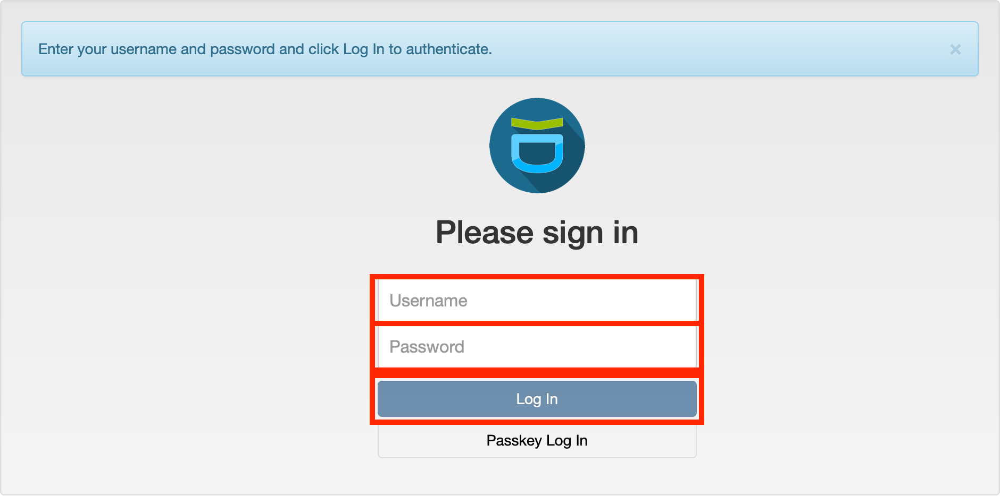
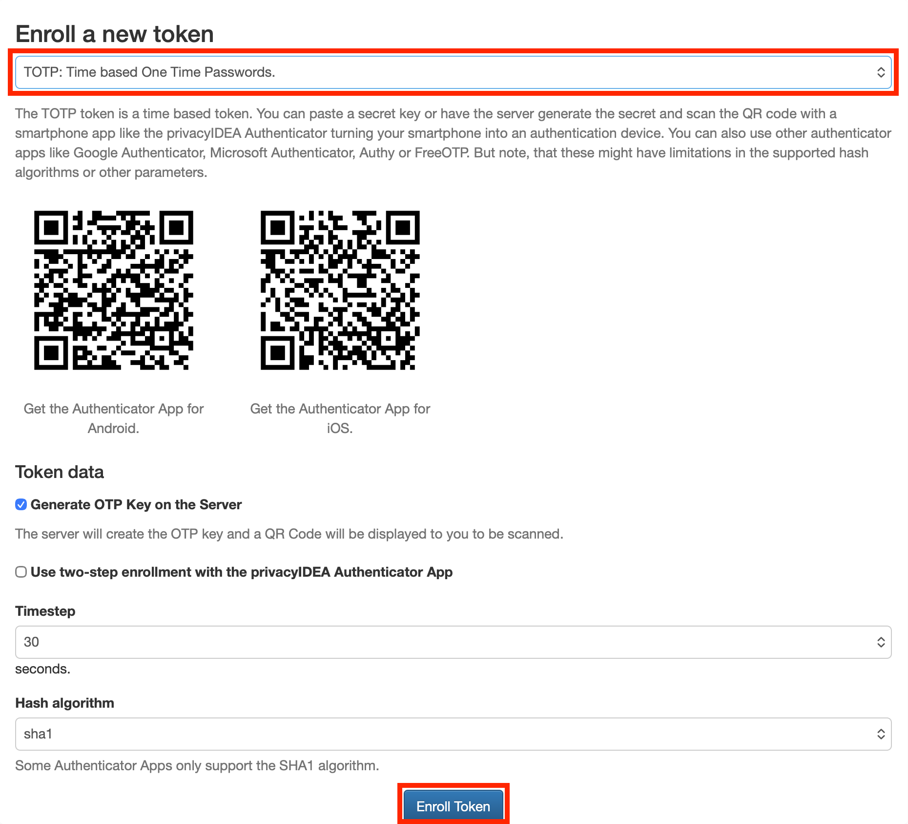
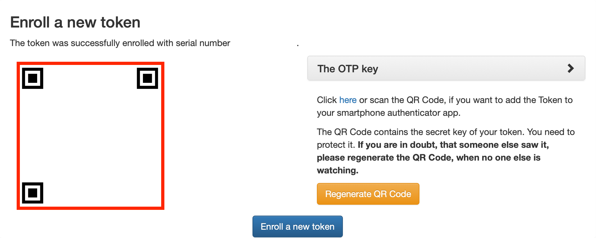

<!-- START -->
# Set Up Multi-Factor Authentication

Multi-Factor Authentication (MFA) adds a security layer beyond SSH keys.
After setup, every cluster login requires two distinct factors: an SSH
public key (first factor) and a dynamic verification code (second
factor). This guide covers how to register for MFA, choose an
authentication method, and complete a cluster login.

<nav class="progress-track" aria-label="Getting started progression">
    

        
✓

        
Enable your cluster access

    

    

        
2

        
Set up MFA

    

    

        
3

        
Connect to the cluster

    

    

        
4

        
Run your first job

    

    

        
5

        
Train your first model

    

</nav>

## What this guide covers

* Choose a second-factor authentication method
* Register on the MFA web portal using an email registration token

---

## Set up Multi-Factor Authentication (MFA) { #set-up-mfa }

Cluster access requires **two factors**: an SSH key (first factor) and a second
factor (TOTP, push notification, or email token). The MFA setup **must** be
completed before connecting via SSH.

### Get your registration token

Look for an email with the subject *Votre accès temporaire registrationcode /
Your temporary access registrationcode*; it contains a **one-time registration
token** that expires after use.

### First-time MFA setup

!!! warning "Set up TOTP before leaving"
    After the first visit, the MFA web portal will **only** accepts a TOTP code.
    Leaving without setting up TOTP locks out the account, and a new
    registration token will be needed from [IT
    support](https://it-support.mila.quebec).

1. Go to **https://mfa.mila.quebec**.

    

2. **Username:** your cluster username (**not** your `@mila.quebec` email
   address).

3. **Password:** enter the **registration token** from the email (**not** your
   account password).

4. After logging in, **immediately** add at least one **TOTP** token to your
   account:

    

    1. Install a TOTP authenticator app:

        - privacyIDEA Authenticator
          ([:material-android:](https://play.google.com/store/search?q=privacyidea%20authenticator&c=apps)
          /
          [:material-apple:](https://apps.apple.com/iphone/search?term=privacyidea%20authenticator)).
        - Authy
          ([:material-android:](https://play.google.com/store/search?q=authy&c=apps)
          /
          [:material-apple:](https://apps.apple.com/iphone/search?term=authy)).
        - Google Authenticator
          ([:material-android:](https://play.google.com/store/search?q=google%20authenticator&c=apps)
          /
          [:material-apple:](https://apps.apple.com/iphone/search?term=google%20authenticator)).

    2. In the authenticator app, scan the QR code shown on the MFA page to add
       the token:

        

## Troubleshooting

**TOTP codes rejected**
:   TOTP codes are time-sensitive. Set the smartphone clock to
    automatic time synchronization to keep codes valid.

**Lost phone or device**
:   Contact [IT Support](https://it-support.mila.quebec) immediately
    to reset MFA tokens.

---

## Next step

-   [:material-run-fast:{ .lg .middle } __Log in to the cluster__](userguides/login.md)
    { .card }

    ---
    Connect to the Mila cluster via SSH with MFA configured.

&nbsp;

