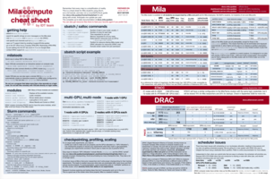

<!-- START -->
# Cheat Sheet

A "cheat sheet" is available to provide you with information about the Mila and DRAC clusters at a glance.

The production run consists of about 400 copies.
If you want to have a copy, you can always come to the IDT lab during office hours (usually Tuesday 3pm-5pm and Wednesday 2pm-4pm).

The [IDT Cheat Sheet pdf](../_static/2026-05-05_Mila_compute_cheat_sheet_v4.pdf) is available if you want to access it online.
The layout of the pdf has been set to be compatible with the printers at Mila
so you can always print your own copy on regular paper
(hint: set printer scale 100% with no margins).

Keep in mind that the cheat sheet is not a replacement for the official documentation,
which is the original source of information.
Moreover, the official documentation is updated regularly, whereas the cheat sheet
is probably going to be updated once a year. Usually this happens around April when the new DRAC allocations are announced,
but in 2025, the update happened in July because of the new DRAC allocations that got delayed.

Comments and suggestions are welcome ([idt.cheatsheet@mila.quebec](mailto:idt.cheatsheet@mila.quebec)).
Please also signal errors if you spot them before we do.

## Errata

Here is a list of the known errors in the cheat sheet that will have to be fixed in the next version.

### Partition preemption is not explained accurately on page 2

This is is not technically an error, but it is an oversimplification that might lead to some confusion.

The preemption on the Mila cluster is a bit more complicated than what is described in the cheat sheet.
The jobs from the `long` partition can be preempted to allow jobs in the `main` partition to run,
but jobs in `main` are never going to be preempted to allow for other jobs in `main`, no matter how much
of the "fair use" a user has already consumed.

Jobs for the `unkillable` partition can preempt everything except other jobs on the `unkillable` partition.

A good explanation of priorities and preemption will be added to the documentation,
but the cheat sheet (or the cheat sheet errata) is not the place for this.

### Tamia also has H200 GPUs

The cheat sheet mentions that Tamia has H100 GPUs, but it also has nodes with 8 x H200. See [Tamia wiki](https://docs.alliancecan.ca/wiki/TamIA/en) for more information.

### STACC is called Lynx

The compute cluster originally planned to be called "STACC" is going to be called "Lynx" instead.