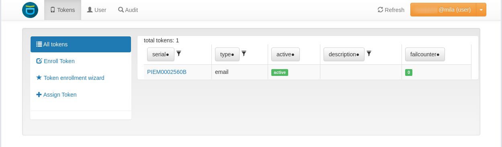
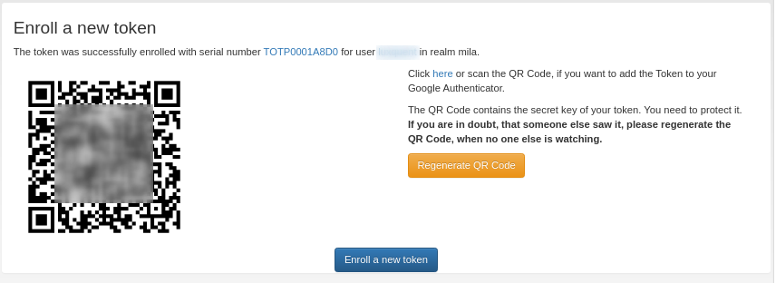
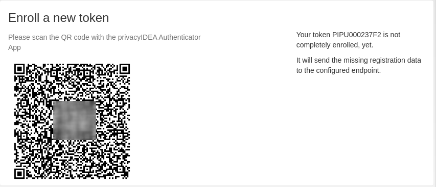

Multi-Factor Authentication
############################

Mila is implementing a multi-factor authentication to further secure the ssh access to the cluster.
While you will still have the ability to login with your password or an ssh-key pair, **once every 7 days**
you will have to complete a 2nd-factor authentication.

The Token generation will be provided by an internal service called PrivacyIdea
and it currently supports the following token forms:

- Email
- SMS
- TOTP will Google Authenticator
- Push with the PrivacyIdea Mobile App

**OTP = One-Time Password**

Connection procedure
^^^^^^^^^^^^^^^^^^^^^

Login-nodes are protected with multi-factor authentication. On your first connection, you will be guided through
the generation of your first token. Afterwards you will have the ability to connect to the PrivacyIdea WebUI
to manage and create new token.

If you don't have a token yet
""""""""""""""""""""""""""""""

- When you ssh into a login-node you will be prompted to choose the type of 2FA
  token you want to generate and to choose a PIN associated with it:

.. code-block:: bash

    [user@workstation ~]$ ssh my_username@loginnode

    Please choose the token to generate:
    [1] Email
    [2] Push
    [3] Google Authenticator

    Please choose a 4-digit minimum PIN:

- Choose a new PIN and confirm it. Once chosen, you will receive a confirmation that your token has been created in PrivacyIdea

.. image:: new_token.png
    :align: center
    :alt: new_token

- For each token type, proceed accordingly:

  - **PUSH:** open the generated link to scan the QR Code with the PrivacyIdea Application
  - **TOTP:** scan or open the generated link with the QR Code to use with the Google Authenticator Application.
  - **Mail/SMS:** no further action is required.

- You can then proceed to the next section

.. note::
   You can have multiple token types associated with your account. Just remember that a **PIN triggers
   the associated 2FA token** so don't choose the same PIN for different tokens.

When you have a token
""""""""""""""""""""""

- When you ssh into a login-node you will be prompted to enter your **2FA PIN/OTP**  (PIN or PIN+OTP for TOTP)

.. code-block:: bash

    [user@workstation ~]$ ssh my_username@loginnode

    Enter your 2FA PIN/OTP:

- Depending on the type of token, actions will be different:

  - **PUSH:** enter the associated PIN and wait for the notification on your mobile to confirm.
  - **Mail/SMS:** enter the associated PIN and wait for your OTP and enter it in the shell.
  - **TOTP:** enter the PIN+TOTP concatenated.

*Example for the mail token*:

1. Enter the PIN and you will receive your One-Time Password by mail:

.. image:: email_token.png
    :align: center
    :alt: email_token

2. You can then enter it in your shell

.. code-block:: bash

    ...
    Enter the OTP from the Email:

.. note::
  If you get a ``Connection closed by 172.XX.XX.XX port 2222``, it means you
  have waited too much time between 2 steps of the authentication.
  You can start again but remember there is a *10-error maximum counter on each account*.

Generate and manage Tokens
^^^^^^^^^^^^^^^^^^^^^^^^^^^

If you went through the previous section you should already have a token associated with your account.
To manage the tokens associated with your account you can log into the PrivacyIdea website
with your **Gsuite credentials**:
https://auth.server.mila.quebec/

Once connected you should get the list of all your tokens:

**REMEMBER: 1 PIN = 1 Token**, do not use the same PIN for each authentication. When you enter a PIN during the authentication,
it will trigger the associated token authentication.

Reset a PIN
"""""""""""""

If you click on a Token, you will get more information on it and you will be able to reset its PIN by using the **Set PIN** button:

.. image:: reset_pin.png
    :align: center
    :alt: reset_pin

Generate an SMS Token
""""""""""""""""""""""

Mila doesn't keep a list of all phone numbers so you are responsible for adding
the correct phone number to your SMS token.

To generate a new SMS Token, click and **Enroll Token** and fill-out the form
with your **Phone Number** and choose a new **PIN** that will be associated with SMS authentication:

.. image:: sms_token.png
    :align: center
    :alt: sms_token

And click on the **Enroll Token**.

Generate a TOTP Token
"""""""""""""""""""""""""

TOTP stands for Time-based One-Time Password and are generated through
2-Step Verification code application like **Google Authenticator**.

If you want to use a TOTP token, you must first install Google Authenticator or
any supported Verification code generator. Then click on **Enroll Token** and
leave all default values and choose a new **PIN** that will be associated with TOTP authentication:

.. image:: totp_token.png
    :align: center
    :alt: totp_token

Click on the **Enroll Token**. A QR Code that you can scan with your mobile
application will be generated to set-up the corresponding token on your phone
(a copy will be sent to your email):

To authenticate with a TOTP while login into a login node you will have
to enter your **PIN** + the **TOPT** concatenated, i.e. if your PIN is *1234*
and the generated TOPT is *785698* you will have to enter *1234785698*
when prompted for the PIN/OTP.

Generate a Push Token
"""""""""""""""""""""""

A mobile application by PrivacyIdea is provided to trigger a Push Authentication
that will only requires to validate the connection through a notification.

To start you will need to install the PrivacyIdea Authenticator App:

- `Android <https://play.google.com/store/apps/details?id=it.netknights.piauthenticator>`_
- `IOS <https://apps.apple.com/us/app/privacyidea-authenticator/id1445401301>`_

To generate a new PUSH Token, click and **Enroll Token** and choose a new **PIN** that will be associated with PUSH authentication:

.. image:: push_token.png
    :align: center
    :alt: qr_code

Click on the **Enroll Token**. A QR Code that you can scan with the PrivacyIdea mobile application will
be generated to set-up the corresponding token on your phone:

