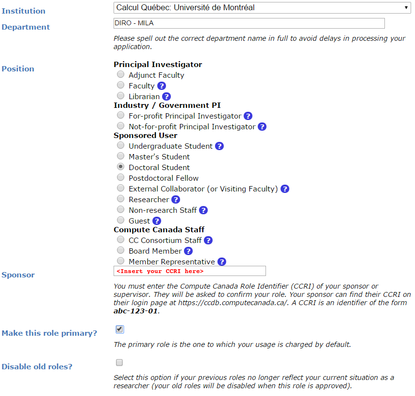

# Digital Research Alliance of Canada Clusters

In addition of the Mila cluster, researchers can have access to clusters
provided by the [Digital Research Alliance of Canada
organisation](https://alliancecan.ca/) (DRAC, or the Alliance). These clusters
are to be used for larger experiments having many jobs, multi-node computation
and/or multi-GPU jobs.

DRAC also collaborates with the [CIFAR AI Chairs](https://www.cifar.ca/ai-chairs)
to provide clusters dedicated to AI research, called the Pan-Canadian AI Compute
Environment (PAICE) clusters. 
See [PAICE Clusters](../paice/index.md) for more information.

Clusters of the Alliance are **shared with researchers across the country**,
in part through a system of **allocations**. Allocations are given by the
Alliance to selected research groups to ensure a steady availability of
computational resources throughout the year. From the Alliance's documentation:
`An allocation is an amount of resources that a research group can target for
use for a period of time, usually a year.`

Every university professor in Canada gets a default allocation, and they can
add their collaborators to it. Depending on your supervisor's affiliations, you
will have access to different allocations. Almost all students at Mila supervised
by "core" professors should have access to the Mila global allocation described
below, but it is not the only one. Your supervisor is your first point of 
contact in knowing which allocations you should have access to.

!!! note
    An allocation is not a *maximal* amount of resources that can be used
    simultaneously, it is a weighting factor of the workload manager to balance
    jobs. For instance, even though we are allocated 408 GPU-years across all
    clusters, we can use more or less than 408 GPUs simultaneously depending on the
    history of usage from our group and other groups using the cluster at a given
    period of time. Please see the Alliance's
    [documentation](https://docs.alliancecan.ca/wiki/Allocations_and_resource_scheduling)
    for more information on how allocations and resource scheduling are
    configured for these installations.

!!! note
    If you use DRAC resources for your research, please remember to [acknowledge
    their use in your
    papers](https://www.alliancecan.ca/en/our-services/advanced-research-computing/acknowledging-alliance).

## Account creation

To access the Alliance clusters you have to first create an account on the [CCDB
Portal](https://docs.alliancecan.ca/wiki/Frequently_Asked_Questions_about_the_CCDB)
at https://ccdb.alliancecan.ca. **We recommend using your @mila.quebec email**.

Then, you have to apply for a ``role`` at
https://ccdb.alliancecan.ca/me/add_role, which basically means telling the
Alliance that you are part of the lab so they know which cluster you can have
access to, and track your usage.

You will be asked for the CCRI (Compute Canada Role Identifier) of your sponsor.
Please reach out to your sponsor for more infos.



As a Mila researcher, you can request access of all the resources in the *HPC*
tabs in *Resources > Access Systems* at CCDB.

You will need to **wait** for your sponsor to accept your request before being
able to login to the Alliance clusters. The default accounts are of the form
``def-<yourprofname>-gpu`` and ``def-<yourprofname>-cpu``. Management of a
professor's default DRAC allocation is their personal responsibility and is
beyond the control of Mila. We are unable to provide support for such
management.

### Access to Mila global allocation

If your supervisor is a Mila "core" professor, you are elligiable to the Mila
global allocation ``rrg-bengioy-ad``. To be added to the allocation, write to
`ccdb-accounts@mila.quebec` and share **your** CCRI.

### Connect to the clusters

To login to the DRAC clusters, you need to set up your SSH keys on the CCDB
portal. You can generate an SSH key pair using `ssh-keygen` and then add the
public key to your account on the CCDB portal at *My Account > SSH Keys*.

You can use `milatools`, with the command `mila init`, to help create your SSH
config or validate your installation.

You also need to set a multifactor authentication on the CCDB portal at *My
Account > Multifactor Authentication*. More infos available on the [DRAC
documentation](https://docs.alliancecan.ca/wiki/Multifactor_authentication).

### Renewal

All user accounts (Sponsor & Sponsored) have to be renewed annually in order to
keep up-to-date information on active accounts and to deactivate unused
accounts.

To find out how to renew your account or for any other question regarding
DRAC's accounts renewal, please head over to their [FAQ](https://www.alliancecan.ca/en/our-services/advanced-research-computing/account-management/account-renewals/account-renewals-faq).

If the FAQ is of no help, you can contact DRAC renewal support team at
``renewals@tech.alliancecan.ca`` or the general support team at
``support@tech.alliancecan.ca``.

## Clusters

The table below provides information on the Mila global allocation with the account
``rrg-bengioy-ad`` for the period which spans from April 7, 2026 to Spring 2027.

| Cluster                | CPUs | RGUs allocated | # GPU equiv | Model    | Unrestricted internet |
| ---------------------- | ---- | -------------- | ----------- | -------- | --------------------- |
| [Fir](#fir)            | 0    | 2090           | 171         | H100-80G | Yes                   |
| [Nibi](#nibi)          | 0    | 363            | 30          | H100-80G | Yes                   |
| [Rorqual](#rorqual)    | 263  | 1172           | 96          | H100-80G | No                    |
| [Trillium](#trillium)  | 768  | 375            | 31          | H100-80G | No                    |

Check the current status of the clusters on the [DRAC status
page](https://status.alliancecan.ca/).

!!! note
    DRAC uses a concept called `RGUs` (Reference GPU Units) to measure the
    allocated GPU resources based on the type of device. This measurement
    combines the FP32 and FP16 performance of the GPU as well as the memory
    size. For example, an NVIDIA A100-40G counts has 4.0 RGUs, while a while an
    H100-80G counts as 12.15 RGUs.
    
    This is an improvement over the previous system of counting physical GPU
    devices and disregarding their actual performance. Saying that "we have 4
    GPUs per researcher" omits which kind of GPUs we're talking about, which is
    fundamentally important.

### Fir

[Digital Research Alliance of Canada doc](https://docs.alliancecan.ca/wiki/Fir/en)

The successor to the legacy Cedar cluster. Retains its filesystem.

### Nibi

[Digital Research Alliance of Canada doc](https://docs.alliancecan.ca/wiki/Nibi/en)

The successor to the legacy Graham cluster. Retains its filesystem.

### Rorqual

[Digital Research Alliance of Canada doc](https://docs.alliancecan.ca/wiki/Rorqual/en)

The successor to the legacy Beluga cluster. No internet access on compute nodes.

### Trillium

[Digital Research Alliance of Canada doc](https://docs.alliancecan.ca/wiki/Trillium/en)

The successor to the legacy Niagara cluster. It is principally but not exclusively a
CPU cluster. No internet access on compute nodes.

Trillium is not run exactly like other clusters. Most notably:

  - Trillium is structured as two sub-clusters, once CPU and one GPU.
    - Trillium (CPU):
        - Login node `trillium.alliancecan.ca`
        - Jobs are allocated on a **per-node basis**, _not_ per-CPU.
    - Trillium-GPU:
        - Login node `trillium‑gpu.alliancecan.ca`
        - Jobs allocated either **per-node**, _or_ **single-GPU** (1/4 node).
  - Both share their filesystem.
  - Job submissions must be made from `$SCRATCH`.

Refer to the Trillium [Quickstart Guide](https://docs.alliancecan.ca/wiki/Trillium_Quickstart) for more
details before using this cluster.

## Other clusters

Theses clusters are not part of the Mila global allocation, but you might have
access to them depending on your supervisor's affiliations.  Please check with
your supervisor.

### Narval

[Digital Research Alliance of Canada doc](https://docs.alliancecan.ca/wiki/Narval/en)

Narval is the oldest cluster still online, and contains the oldest and smallest GPUs (A100-40GB).
For some students, this cluster might be a good choice if they have already set
up there or if the A100 is enough for their experiments (e.g. jobs that cannot
utilize a full H100). No internet access on compute nodes.

## Launching jobs

Users must specify the resource allocation Group Name using the flag
``--account=rrg-bengioy-ad``.  To launch a CPU-only job:

```bash
sbatch --time=1:00:00 --account=rrg-bengioy-ad job.sh
```

!!! note

    The account name will differ based on your affiliation.

To launch a GPU job:

```bash
sbatch --time=1:00:00 --account=rrg-bengioy-ad --gres=gpu:1 job.sh
```

And to get an interactive session, use the ``salloc`` command:

```bash
salloc --time=1:00:00 --account=rrg-bengioy-ad --gres=gpu:1
```

The full documentation for jobs launching on Alliance clusters can be found
[here](https://docs.alliancecan.ca/wiki/Running_jobs#).

## Storage

| Storage          | Path                      | Usage                                                         |
| ---------------- | ------------------------- | ------------------------------------------------------------- |
| `$HOME`          | `/home/<user>/`           | Code, specific libraries                                      |
| `$HOME/projects` | `/project/rrg-bengioy-ad` | Compressed raw datasets                                       |
| `$SCRATCH`       | `/scratch/<user>`         | Processed datasets, experimental results, logs of experiments |
| `$SLURM_TMPDIR`  | (on compute node)         | Temporary job results                                         |

They are roughly listed in order of increasing performance and optimized for
different uses:

* The ``$HOME`` folder on Lustre is appropriate for code and libraries, which
  are small and read once. **Do not write experiemental results here!**
* The ``$HOME/projects`` folder should only contain **compressed raw** datasets
  (**processed** datasets should go in ``$SCRATCH``). We have a limit on the
  size and number of file in ``$HOME/projects``, so do not put anything else
  there.  If you add a new dataset there (make sure it is readable by every
  member of the group using ``chgrp -R rpp-bengioy <dataset>``).
* The ``$SCRATCH`` space can be used for short term storage. It has good
  performance and large quotas, but is purged regularly (every file that has
  not been used in the last 3 months gets deleted, but you receive an email
  before this happens).
* ``$SLURM_TMPDIR`` points to the local disk of the node on which a job is
  running. It should be used to copy the data on the node at the beginning of
  the job and write intermediate checkpoints. This folder is cleared after each
  job, so results there must be copied to ``$SCRATCH`` at the end of a job.

When a series of experiments is finished, results should be transferred back
to Mila servers.

More details on storage can be found [here](https://docs.alliancecan.ca/wiki/Storage_and_file_management).

## Modules

Much software, such as Python or MATLAB, is already compiled and available on
DRAC clusters through the ``module`` command and its subcommands. Their full
documentation can be found [here](https://docs.alliancecan.ca/wiki/Utiliser_des_modules/en).

| Command                  | Description                             |
| ------------------------ | --------------------------------------- |
| `module avail`           | Displays all the available modules      |
| `module load <module>`   | Loads \<module\>                        |
| `module spider <module>` | Shows specific details about \<module\> |

In particular, if you with to use ``Python 3.12`` you can simply do:

```bash
module load python/3.12
```

!!! tip "Python on the cluster"
    If you wish to use Python on the cluster, we strongly encourage you to
    read [Alliance Python Documentation](https://docs.alliancecan.ca/wiki/Python), and in particular the [Pytorch](https://docs.alliancecan.ca/wiki/PyTorch) and/or [Tensorflow](https://docs.alliancecan.ca/wiki/TensorFlow) pages.

The cluster has many Python packages (or ``wheels``), such already compiled for
the cluster. See [here](https://docs.alliancecan.ca/wiki/Python/en) for the
details. In particular, you can browse the packages by doing:

```bash
avail_wheels <wheel>
```

Such wheels can be installed using pip. Moreover, the most efficient way to use
modules on the cluster is to [build your environnement inside your job](https://docs.alliancecan.ca/wiki/Python#Creating_virtual_environments_inside_of_your_jobs).
See the script example below.

## Script example

Here is a ``sbatch`` script that follows good practices on Narval and can serve
as inspiration for more complicated scripts:

```bash
#!/bin/bash
#SBATCH --account=rrg-bengioy-ad         # Yoshua pays for your job
#SBATCH --cpus-per-task=12               # Ask for 12 CPUs
#SBATCH --gres=gpu:1                     # Ask for 1 GPU
#SBATCH --mem=124G                       # Ask for 124 GB of RAM
#SBATCH --time=03:00:00                  # The job will run for 3 hours
#SBATCH -o /scratch/<user>/slurm-%j.out  # Write the log in $SCRATCH

# 1. Create your environement locally
module load StdEnv/2023 python/3.12
virtualenv --no-download $SLURM_TMPDIR/env
source $SLURM_TMPDIR/env/bin/activate
pip install --no-index torch torchvision

# 2. Copy your dataset on the compute node, simultaneously unpacking if
#    needed (Zip, tar); Alternatively, copy the dataset if it's in an
#    advanced format like HDF5, or if you can use Zip directly.
unzip     $SCRATCH/DATASET_CHANGEME.zip    -d $SLURM_TMPDIR
# tar -xf $SCRATCH/DATASET_CHANGEME.tar.gz -C $SLURM_TMPDIR
# cp      $SCRATCH/DATASET_CHANGEME.hdf5      $SLURM_TMPDIR

# 3. Launch your job, tell it to save the model in $SLURM_TMPDIR
#    and look for the dataset into $SLURM_TMPDIR
python main.py --path $SLURM_TMPDIR --data_path $SLURM_TMPDIR

# 4. Copy whatever you want to save on $SCRATCH
cp $SLURM_TMPDIR/RESULTS_CHANGEME $SCRATCH
```

## Using CometML and Wandb

Some compute nodes don't have access to the internet, but there is a special
module that can be loaded in order to allow training scripts to access some 
specific servers, which includes the necessary servers for using CometML and
Wandb ("Weights and Biases").

```bash
module load httpproxy
```

More documentation about this can be found [here](https://docs.alliancecan.ca/wiki/Weights_%26_Biases_(wandb)).

!!! note

    Be careful when using Wandb with `httpproxy`. It does not support sending
    artifacts and wandb's logger will hang in the background when your training
    is completed, wasting resources until the job times out. It is recommended
    to use the offline mode with wandb instead to avoid such waste.


## FAQ

### What to do with  `ImportError: /lib64/libm.so.6: version GLIBC_2.23 not found`?

The structure of the file system is different than a classical Linux, so your
code has trouble finding libraries. See [how to install binary packages](https://docs.alliancecan.ca/wiki/Installing_software_in_your_home_directory#Installing_binary_packages).

### Disk quota exceeded error on `/project` file systems

You have files in ``/project`` with the wrong permissions. See [how to change
permissions](https://docs.alliancecan.ca/wiki/Frequently_Asked_Questions/en#Disk_quota_exceeded_error_on_.2Fproject_filesystems).

!!! warning "This last question might be obsolete"
