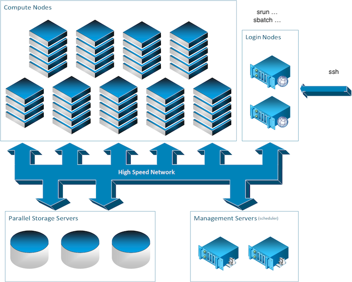

# What is a computer cluster?

A [computer cluster](https://en.wikipedia.org/wiki/Computer_cluster) is a set
of loosely or tightly connected computers that work together so that, in many
respects, they can be viewed as a single system.

## Parts of a computing cluster

To provide high performance computation capabilities, clusters can
combine hundreds to thousands of computers, called *nodes*, which are all
inter-connected with a high-performance communication network. Most nodes are
designed for high-performance computations, but clusters can also use
specialized nodes to offer parallel file systems, databases, login nodes and
even the cluster scheduling functionality as pictured in the image below.

The following sections describe the types of nodes found on a typical cluster.

### The login nodes

To run computations on a cluster, first connect to it through a *login node*.
These so-called login nodes are the entry point to most clusters.

Connections to login nodes typically use a remote shell. The most common tool
for this is [SSH](ssh_on_clusters.md). SSH acts as a long extension cord that
connects a local computer, such as a laptop, to the terminal shell of a
remote computer. A terminal shell is the interface used when working on the
command line.

Another entry point to some clusters such as the Mila cluster is the
[JupyterHub](../../toolbox/jupyterhub.md) web interface.

### The compute nodes

Artificial intelligence workloads typically require GPUs. In most clusters, the
compute nodes are the ones with GPU capacity.

While there is a general paradigm to tend towards a homogeneous configuration
for nodes, this is not always possible in the field of artificial intelligence
as hardware evolves rapidly and new hardware is continually added. As a result,
compute nodes are often grouped into classes, some of which have different GPU
models or no GPU at all. For the Mila cluster, this information is available in
the [Node profile description](../clusters/mila/nodes.md) section. Keep track
of *which* compute nodes the code runs on.

### The storage nodes

Some nodes on a cluster only store and serve files. Users interact only with
the path to the data, not with the storage nodes themselves. See the
[Processing data](data.md) section for details.

### Different nodes for different uses

Compute nodes and login nodes have different intended uses. Compute nodes are
meant for heavy computation; login nodes are not.

Login nodes are shared by all cluster users, so take care not to overburden
them. Run only short, light processes on login nodes; otherwise, the cluster
may become inaccessible. Do not run long or compute-intensive processes on
login nodes, as this affects all other users. Doing so may also result in
administrative action.
