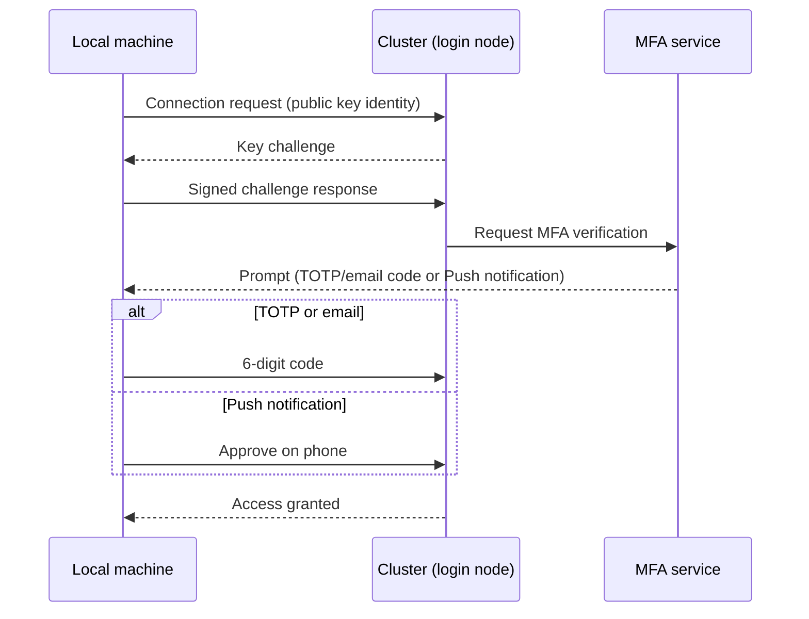

# How SSH authentication works

When connecting to the cluster via SSH, authentication proceeds in
three steps:

1. **Key exchange** — the local machine proves possession of the private key
   matching the public key stored on the cluster.
2. **MFA challenge** — once the key is accepted, the cluster prompts for the
   second factor.
3. **Validation** — for Push, tap "Approve" on the smartphone; for TOTP or
   email, type the code into the terminal prompt.