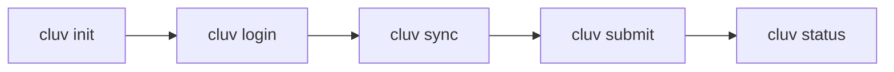
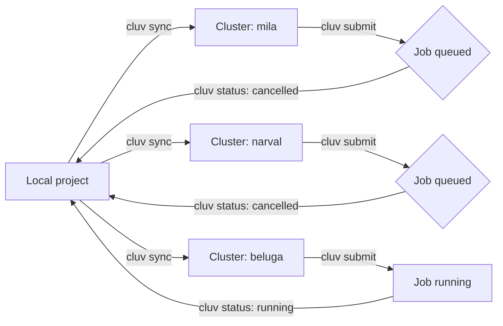

# Get Started with cluv

cluv is a lightweight command-line tool for syncing and submitting
UV-based Python projects across multiple Slurm clusters, including the
Mila cluster. This guide introduces cluv's core commands and the typical
workflow for developing a project locally and running it as a Slurm job.

## Before you begin

<div class="grid cards" markdown>

-   [:material-language-python:{ .lg .middle } __Manage Python Dependencies with uv__](python_uv.md)
    { .card }

    ---
    Set up `uv` to manage project dependencies. cluv relies on `uv` for
    dependency management, so a project must already use it.

-   [:material-key:{ .lg .middle } __Logging in to the cluster__](login.md)
    { .card }

    ---
    Configure SSH access to the Mila cluster. cluv reuses this SSH setup to
    connect to clusters.

-   [:material-server:{ .lg .middle } __Launch jobs__](slurm_guide/index.md)
    { .card }

    ---
    Learn the Slurm concepts (jobs, queues, `sbatch`) that cluv commands
    build on.

</div>

!!! success "Requirements"
    - Python 3.11 or higher, plus the `uv` package manager, installed
      locally.
    - A project hosted in a GitHub repository.
    - SSH access configured in `~/.ssh/config` for each target cluster,
      with ControlMaster sessions enabled for passwordless authentication.
      Windows users need WSL2, since cluv does not run natively on Windows.

## What this guide covers

* What cluv is and the problem it solves
* Installing cluv
* Setting up a project for cluv
* Connecting to clusters and syncing a project
* Submitting and monitoring jobs

---

## What is cluv?

cluv wraps SSH, `uv`, and Slurm into a small set of commands, so a project
can be developed locally, synced to one or several clusters, and submitted
as a job without hand-writing separate `rsync`, `ssh`, and `sbatch`
invocations for each cluster.



!!! important "Scope"
    cluv does not configure SSH access or GitHub authentication, and it
    does not modify system-level cluster configuration. Set these up first
    using the guides above.

## Installing cluv

=== "As a project dependency"

    ```bash
    uv add cluster-uv
    ```

=== "With Hydra launcher support"

    ```bash
    uv add cluster-uv[hydra]  # (1)!
    ```
    { .annotate }

    1.  Adds a Hydra launcher plugin, so a Hydra sweep can dispatch each
        run as a separate cluv job across clusters.

=== "As an isolated CLI tool"

    ```bash
    uv tool install cluster-uv
    ```

=== "Development version from GitHub"

    ```bash
    uv add git+https://github.com/mila-iqia/cluv
    ```

## Setting up a project

### Initialize the project

```bash
cluv init
```

`cluv init` adds a `[tool.cluv]` section to the project's `pyproject.toml`,
where clusters and other cluv settings are configured.

### Connect to a cluster

```bash
cluv login
```

`cluv login` opens an SSH ControlMaster session to a configured cluster.
Later cluv commands reuse this session instead of prompting for
authentication again.

### Sync the project

```bash
cluv sync
```

`cluv sync` copies the project to a cluster, or to every configured
cluster at once, and runs `uv sync` remotely so dependencies are installed
on each cluster.

## Submitting and monitoring jobs

A single project can be synced and submitted to several clusters at once,
so the first cluster with free resources runs the job:



### Submit a job

```bash
cluv submit mila job.sh
```

`cluv submit` runs `job.sh` on the named cluster (`mila` here). When a job
is submitted to several clusters at once, cluv cancels the instances that
end up waiting in the queue once one instance starts running, so the job
does not run redundantly.

### Run a command remotely

```bash
cluv run
```

`cluv run` executes a command inside the synced project directory on a
cluster, without submitting it as a Slurm job.

### Check cluster and job status

```bash
cluv status
```

`cluv status` shows a per-cluster overview: GPU availability, queue
status, and the progress of submitted jobs.

### Clean up results

```bash
cluv clean
```

`cluv clean` removes run results from a cluster after the matching local
results have been deleted.

---

## Key concepts

`[tool.cluv]`
:   Section in `pyproject.toml`, created by `cluv init`, where clusters and
    project settings for cluv are configured.

ControlMaster
:   An SSH feature that keeps a connection open and reuses it, so cluv
    commands after `cluv login` do not prompt for authentication again.

`uv sync`
:   The `uv` command cluv runs on each cluster during `cluv sync`, to
    install the project's dependencies remotely.

## Next step

<div class="grid cards" markdown>

-   [:material-book-open-page-variant:{ .lg .middle } __cluv documentation__](https://mila-iqia.github.io/cluv/)
    { .card }

    ---
    Full command reference, configuration options, and Hydra launcher
    details.

&nbsp;

</div>
