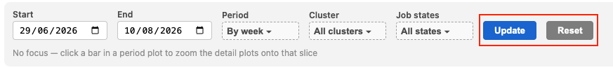
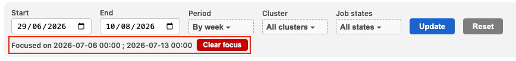

# Compute Utilization Dashboard

**[Link to dashboard](https://sarc-api-949207715981.northamerica-northeast1.run.app/dash/metrics).
Access granted with Mila credentials.**                                                                                                 

The **Compute Utilization Dashboard** provides visibility into cluster usage. The
goal is to help understand job's efficiency and spot underutilized resources.
After reading this document, if you have any doubts about how to best leverage
the dashboard, please reach out to the [IDT team](../../help/office_hours.md).

As a reminder, optimizing GPU usage accelerates research velocity (your work and
the work of others). On the flip side, suboptimal utilization holds you back,
and prejudices the entire Mila community.

## Core concepts to understand your utilization

### How is compute power calculated and represented?

#### Definition of RGU
The RGU (Reference GPU Unit) was implemented by the [Digital Research Alliance
of Canada](../../technical_reference/clusters/drac/index.md) to serve as the
benchmark GPU unit across different GPU models. Relying on the standard RGU
unit enables monitoring to be more accurate and more robust in a context of
diverse and evolving compute supply.

For reference, 1 A100-40Gb = 4 RGUs.

#### Calculation of RGU
The compute power allocated to a job is the product of 3 elements: the type
of GPU (each amounting to a specific RGU value), the number of GPUs, and
the elapsed time during which the job runs. Compute power is typically
expressed over a period to measure total resource consumption over time. 

Example: Getting 1 RGU for 1 week equals 1 RGU·w. Getting 2 RGUs for half a
week also equals 1 RGU·w.

#### Timestamp
In the dashboard, compute allocation is by default segmented by week based
on on execution time. If a job runs across two calendar weeks (e.g., starts
in Week 1 and finishes in Week 2), its fixed metrics (RGU value, GPU number)
will remain the same, but its elapsed time will be split accordingly (e.g.,
~6 days accounted for in Week 1, and ~4 days in Week 2).

#### Cost
For reference, 1 RGU.year costs approximately 1100$, so 1 RGU.w = 21$, and
1 RGU.h = 0.125$.

### How is waste defined?

Various cluster statistics are available. We choose to look at the two following
measurements:

#### gpu_utilization
This metric reports the proportion of the job duration during which one or
more kernel was running on the GPU. This represents an intuitive measurement
about how “busy” the GPU was, but the downside is that it does not depend on
how much of the hardware is actually in use. When `gpu_utilization` is low or
equals zero, there is obvious waste and inefficiencies to tackle quickly.

However, this measurement can reach 100% without any guarantee that a GPU is
being used optimally.

#### SM occupancy (SMO)
The Compute Utilization Dashboard is based on **Streaming Multiprocessor (SM)
Occupancy** that better represents the notion of a GPU being used to its full
compute potential.

It measures the ratio of active threads/warps on the GPU relative to the
theoretical maximum the processor (SM) can handle in parallel. It indicates
how effectively your code leverages the raw compute power allocated to you.
High SM occupancy means the code is executing densely and efficiently on the
GPU; whereas low SM occupancy means most of the GPU is unused.

### What is an acceptable waste level?
It is almost impossible to achieve an SMO close to 100%. Anything above 80% is
spectacularly good. Refer to the below benchmark to understand and interpret
your SM occupancy:

* **≥ 50%**: Excellent utilization

* **30% - 50%**: Good utilization, little margin for optimization

* **15% - 30%**: Good utilization, with room for improvement

* **5 - 15%**: Poor utilization, vast room for improvement

* **< 5%**: Critical waste

We consider the 15% threshold as a good starting point to focus our attention.
Below 15% smo, there are definitely improvements to be implemented to tackle
typical issues (e.g., CPU bottlenecks, slow data transfers, batch size too small),
leading to wasted compute power ([learn more](./profiling.md)). Therefore,

* the chart [“RGU allocated vs efficiency levels"](#rgu-allocated-vs-efficiency-levels)
in the dashboard is framed around Efficiency levels: the GPU power is split
into *Used*, *Acceptable Idle*, and *Critical Waste*. 

* if your smo is below 15% for 2 weeks straight, you will receive a “waste
notification” inviting you to act and optimize your jobs.

## Dashboard layout

### 🎛️ Filter bar (Top)

Allows you to adjust the analysis window (`Start / End`), time aggregation
(`Period`), target cluster, or job status (`Job states`).

!!! tip
    Click "Update" to apply your filters, or "Reset" to restore default settings.

    

### 📊 Main visualizations

#### RGU allocated vs efficiency levels
This chart tracks your efficiency over time based on SM occupancy, categorizing
your RGU·w into three states:

* 🔵 *Used*: The allocated compute actively performed computations.

* 🔴 *Critical Waste* (Below 15% threshold): Unused compute from jobs running
under the 15% minimum efficiency thresholds. This is the unacceptable portion
of unused compute from jobs that failed to reach our minimum efficiency threshold
(15% SM occupancy). This represents direct, preventable resource loss.

* 🌐 *Acceptable Idle* (Above 15% threshold): Unused compute capacity remaining
above the 15% minimum threshold. The remaining unused compute allocated to jobs
that met or exceeded the 15% efficiency baseline.

* ⚪ *No data*: Telemetry could not be gathered (e.g., the cluster running
the job is not yet connected to the service).

The chart also shows the mean SM occupancy (in black) and `gpu_utilization`
(in purple) for each week, for jobs that have been submitted during that week.
Hover over the chart to see the exact values.

**Goal**: Remove *Critical Waste* first, then shift from *Acceptable Idle* to
*Used*.

!!! note
    IDT is working with DRAC to retrieve telemetry data and reduce *No data* portion.

#### RGU by cluster
This stacked bar chart shows total RGU consumption breakdown by cluster
(mila, narval, tamia, etc.) over time.

**Goal**: Take advantage of all available clusters, especially DRAC clusters,
which often have higher available capacity than the local Mila cluster.
IDT recommends using tools like [milatools](https://github.com/mila-iqia/milatools)
and [cluv](https://mila-iqia.github.io/cluv/) to easily submit jobs across all clusters.

#### Job table
An interactive table listing all executed jobs along with key properties: Job ID,
submission/start/end dates, final status (`COMPLETED`, `FAILED`, etc.), and detailed
metrics on requested, allocated, and actually used compute.

**Goal**: Provide granular insights to help you identify specific areas where
your cluster runs can be optimized.

## Dashboard features

### Click to focus
Click any bar in a chart to focus on that specific time period. The
[Job table](#job-table) will automatically filter to match
your selection. To clear the focus, click the bar again or select "Clear focus"
in the filter bar.

