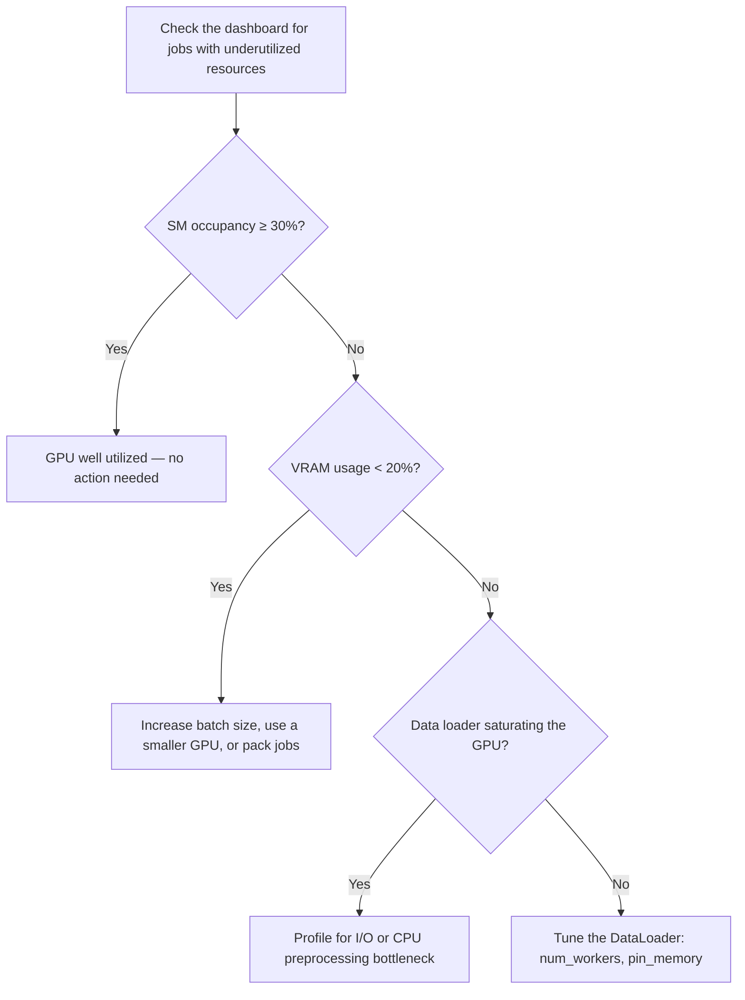
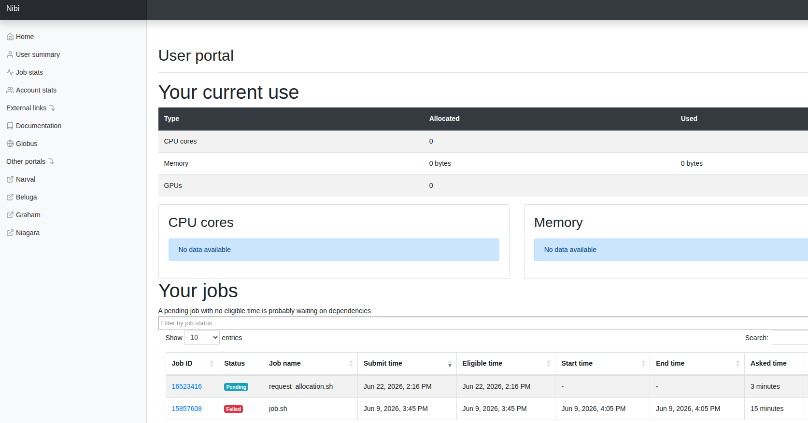

# Could My Job Run Faster? How to Identify GPU Waste

This guide explains how to read GPU efficiency metrics, diagnose an
underutilized job, and apply concrete best practices to improve throughput on
the Mila cluster.

## Before you begin

<div class="grid cards" markdown>

-   [:material-monitor:{ .lg .middle } __Monitor runs with WandB__](../wandb.md)
    { .card }

    ---
    Track GPU utilization, CPU usage, and memory for a run.

-   [:material-server:{ .lg .middle } __Slurm basics__](../slurm_guide/basics.md)
    { .card }

    ---
    Submit and allocate jobs on the cluster.

-   [:material-server:{ .lg .middle } __Compute Utilization Dashboard__](dashboard.md)
    { .card }

    ---
    Use the dashboard to identify and reduce wasted GPU resources.

</div>

## What this guide covers

* Compute efficiency concepts: utilization vs. occupancy
* How to diagnose an underutilized job
* Best practices for efficient GPU use on the cluster

---

## Why GPU efficiency matters

Optimizing GPU usage directly accelerates research velocity. As compute power
at Mila is a shared resource, efficient jobs on the cluster bring a two-sided
advantage:

- **For the researcher:** Eliminating bottlenecks speeds up training times and
  helps unearth hidden bugs in data loaders or model architectures. With
  properly sized compute requests and efficient utilization, jobs start sooner
  and produce useful results faster.
- **For Mila:** Maximizing efficiency frees up cluster nodes, resulting in
  shorter queue times and more parallel experiments across the institute.

In other words, efficient compute utilization makes Mila research thrive.

## The basics of compute efficiency: utilization vs. occupancy

`nvidia-smi` is a useful first check, but its utilization metric has
limitations: it reports "100% Utilization" as soon as any kernel is running on
the GPU, regardless of how much of the hardware is actually in use. So if the
reported GPU utilization is low or equals zero, it usually means there is room
for optimization. For a more precise view, look at **Streaming Multiprocessor
(SM) Occupancy**, which measures what fraction of the GPU's computing units are
actively working.

Use the table below as a reference to evaluate SM occupancy:

| SM Occupancy | Assessment |
|---|---|
| < 5% | Critical waste |
| ~15% | Poor utilization — the GPU is mostly waiting |
| ~30% | Good utilization |
| ≥ 50% | Great / optimized utilization |

## How to diagnose a job

Self-diagnosis is possible using these framework-agnostic methods. The
flowchart below outlines the decision path:



Here are various ways you can obtain the required metrics (notably CPU/GPU
utilization, VRAM usage, SM occupancy):

### Method A: Milalib

[Milalib](https://github.com/mila-iqia/milalib) is a utility you can run on
the Mila cluster and some DRAC clusters to stream the relevant GPU and CPU
metrics. For example, assuming [uv](../python_uv) is installed, the following
command will output the `sm_occupancy` metric every 5 seconds:

```bash
uvx milalib monitor -i 5 -m sm_occupancy
```

You can run this command interactively, or as a background process in your
jobs, with its output redirected to a file.

### Method B: Weights & Biases

In WandB, the **System** tab of a run shows data on GPU utilization, CPU
usage, and memory. See
[Diagnose training bottlenecks](../wandb.md#diagnose-training-bottlenecks)
for details.

!!! warning "Some measurements may be inaccurate"
    WandB measures CPU and RAM utilization on the entire node (all cores
    and all memory), even if you were only allocated part of it.

**Using milalib**

We recommend using [milalib](https://github.com/mila-iqia/milalib) to add
performance metrics to your wandb dashboard. Notably, milalib's CPU/RAM
measurements should be accurate:

```python
import wandb
from milalib.wandb import monitor

wandb.init(...)  # initialize wandb first

with monitor(interval=5):
    # train your model
```

### Method C: The interactive check

During a job, `srun` into the allocated node and run basic checks:

```bash
# Check GPU utilization and power draw
nvidia-smi

# High power draw (Watts) is usually a good signal of active GPU utilization.
```

Or, using milalib:

```bash
uvx milalib monitor -i 1 -m gpu_util -m mem_util -m power -m sm_occupancy
```

### Method D: The NVSMI log

When a job runs on the cluster, an output file is created with the default
name `slurm-<JOB_ID>.out`. This file contains the job's output, along with an
NVSMI LOG section reporting metrics such as GPU and memory utilization.

??? info "Example"

    ```
      ======== GPU REPORT ========

      ==============NVSMI LOG==============

      Timestamp                                              : Mon Jun  8 15:08:15 2026
      Driver Version                                         : 580.159.03
      CUDA Version                                           : 13.0

      Attached GPUs                                          : 2
      GPU 00000000:61:00.0
         Accounting Mode                                    : Enabled
         Accounting Mode Buffer Size                        : 4000
         Accounted Processes
            Process ID                                     : 3072883
                  GPU Utilization                            : 12 %
                  Memory Utilization                         : 3 %
                  Max memory usage                           : 998 MiB
                  Time                                       : 86816 ms
                  Is Running                                 : 0

      GPU 00000000:CA:00.0
         Accounting Mode                                    : Enabled
         Accounting Mode Buffer Size                        : 4000
         Accounted Processes
            Process ID                                     : 3072884
                  GPU Utilization                            : 15 %
                  Memory Utilization                         : 3 %
                  Max memory usage                           : 998 MiB
                  Time                                       : 86868 ms
                  Is Running                                 : 0

      Mon Jun  8 15:08:15 2026
      +-----------------------------------------------------------------------------------------+
      | NVIDIA-SMI 580.159.03             Driver Version: 580.159.03     CUDA Version: 13.0     |
      +-----------------------------------------+------------------------+----------------------+
      | GPU  Name                 Persistence-M | Bus-Id          Disp.A | Volatile Uncorr. ECC |
      | Fan  Temp   Perf          Pwr:Usage/Cap |           Memory-Usage | GPU-Util  Compute M. |
      |                                         |                        |               MIG M. |
      |=========================================+========================+======================|
      |   0  NVIDIA L40S                    On  |   00000000:61:00.0 Off |                    0 |
      | N/A   35C    P0            105W /  325W |       0MiB /  46068MiB |      0%      Default |
      |                                         |                        |                  N/A |
      +-----------------------------------------+------------------------+----------------------+
      |   1  NVIDIA L40S                    On  |   00000000:CA:00.0 Off |                    0 |
      | N/A   36C    P0            102W /  325W |       0MiB /  46068MiB |      0%      Default |
      |                                         |                        |                  N/A |
      +-----------------------------------------+------------------------+----------------------+

      +-----------------------------------------------------------------------------------------+
      | Processes:                                                                              |
      |  GPU   GI   CI              PID   Type   Process name                        GPU Memory |
      |        ID   ID                                                               Usage      |
      |=========================================================================================|
      |  No running processes found                                                             |
      +-----------------------------------------------------------------------------------------+

      ======== GPU REPORT ========

      ==============NVSMI LOG==============

      Timestamp                                              : Mon Jun  8 15:08:15 2026
      Driver Version                                         : 580.159.03
      CUDA Version                                           : 13.0

      Attached GPUs                                          : 2
      GPU 00000000:61:00.0
         Accounting Mode                                    : Enabled
         Accounting Mode Buffer Size                        : 4000
         Accounted Processes
            Process ID                                     : 3072883
                  GPU Utilization                            : 12 %
                  Memory Utilization                         : 3 %
                  Max memory usage                           : 998 MiB
                  Time                                       : 86816 ms
                  Is Running                                 : 0

      GPU 00000000:CA:00.0
         Accounting Mode                                    : Enabled
         Accounting Mode Buffer Size                        : 4000
         Accounted Processes
            Process ID                                     : 3072884
                  GPU Utilization                            : 15 %
                  Memory Utilization                         : 3 %
                  Max memory usage                           : 998 MiB
                  Time                                       : 86868 ms
                  Is Running                                 : 0

      Mon Jun  8 15:08:16 2026
      +-----------------------------------------------------------------------------------------+
      | NVIDIA-SMI 580.159.03             Driver Version: 580.159.03     CUDA Version: 13.0     |
      +-----------------------------------------+------------------------+----------------------+
      | GPU  Name                 Persistence-M | Bus-Id          Disp.A | Volatile Uncorr. ECC |
      | Fan  Temp   Perf          Pwr:Usage/Cap |           Memory-Usage | GPU-Util  Compute M. |
      |                                         |                        |               MIG M. |
      |=========================================+========================+======================|
      |   0  NVIDIA L40S                    On  |   00000000:61:00.0 Off |                    0 |
      | N/A   35C    P0            106W /  325W |       0MiB /  46068MiB |      0%      Default |
      |                                         |                        |                  N/A |
      +-----------------------------------------+------------------------+----------------------+
      |   1  NVIDIA L40S                    On  |   00000000:CA:00.0 Off |                    0 |
      | N/A   36C    P0            102W /  325W |       0MiB /  46068MiB |      0%      Default |
      |                                         |                        |                  N/A |
      +-----------------------------------------+------------------------+----------------------+

      +-----------------------------------------------------------------------------------------+
      | Processes:                                                                              |
      |  GPU   GI   CI              PID   Type   Process name                        GPU Memory |
      |        ID   ID                                                               Usage      |
      |=========================================================================================|
      |  No running processes found                                                             |
      +-----------------------------------------------------------------------------------------+
    ```

### Method E: TensorBoard visualization of PyTorch profiler data

* [PyTorch profiler](https://docs.pytorch.org/tutorials/recipes/recipes/profiler_recipe.html)
  is a tool that measures the resource consumption of an experiment.
* [TensorBoard](https://www.tensorflow.org/tensorboard) is a visualization
  toolkit that can log and display experiment usage.

!!! warning "TensorBoard should not be launched on login nodes"
    Launch it from an interactive or batch job on a compute node instead.

An example of TensorBoard usage on the cluster is described in the
[Visualizing usage with PyTorch profiler and TensorBoard](using_tensorboard_and_pytorch_profiler.md)
guide.

### Method F: Cluster portals

Some clusters have a related portal for displaying data and metrics, such as
resource usage or job history.

Here is a quick overview of the clusters and their associated portals (if applicable):





## Best practices for efficient GPU use

Even though situations are diverse, the following guidelines pave the way
for efficient GPU utilization.

!!! tip "Do — improve efficiency"
    - **Profile before scaling:** Run a test job with a profiler (WandB or
      TensorBoard) before launching large sweeps to ensure the data loader
      saturates the GPU.
    - **Optimize data pipelines:** Set `num_workers > 0` (2–4 per allocated
      GPU) and enable `pin_memory=True` in the PyTorch `DataLoader` to prevent
      GPU stalling.
    - **Implement checkpointing:** [Save training states regularly](../../examples/good_practices/checkpointing/index.md)
      so jobs resume automatically after preemption or timeouts without losing
      previous compute hours.
    - **Right-size resource requests:** Use
      [lower-tier nodes](../../technical_reference/clusters/mila/nodes.md) (e.g.,
      RTX8000, V100) or [MIG (Multi-Instance GPU)
      slices](https://docs.alliancecan.ca/wiki/Multi-Instance_GPU) for small
      models or debugging instead of allocating full high-end nodes.
    - **Request minimal compute blocks:** When possible, request the smallest
      allocation that fits the job. Smaller allocations fill queue gaps faster,
      reducing wait time.

!!! warning "Don't — common pitfalls"
    - **Hoarding nodes:** Do not keep high-end GPUs (e.g., H100s) allocated on
      interactive partitions while away from the keyboard. Release them if not
      actively computing.
    - **Avoiding preemption queues:** Do not camp on non-preemptible partitions
      to avoid writing checkpointing code — this significantly reduces
      overall queue priority.
    - **Over-allocating CPU cores:** Do not request excessive CPU cores (e.g.,
      40 CPUs for 1 GPU) unless preprocessing explicitly requires it. Mila
      provides CPU-only nodes if needed.
    - **Scaling GPUs to fix I/O bottlenecks:** Do not add more GPUs if
      storage read latency or CPU preprocessing bottlenecks the pipeline —
      this only idles more hardware.
    - **Underutilizing VRAM:** If VRAM usage is under 20%, consider increasing
      batch size, switching to a smaller GPU, or using [job packing](../../technical_reference/general_theory/multigpu.md/#packing-jobs)
      (multiple smaller jobs on the same node).

---

## Key concepts

**SM Occupancy**
:   The fraction of a GPU's Streaming Multiprocessors (computing units) that
    are actively working. A more precise measure of GPU use than the
    `nvidia-smi` utilization metric.

**GPU Utilization**
:   The `nvidia-smi` metric that reports 100% as soon as any kernel runs on the
    GPU, regardless of how much hardware is in use. Useful as a first check but
    misleading on its own.

**MIG (Multi-Instance GPU)**
:   A feature that partitions a single GPU into smaller isolated slices, well
    suited to small models or debugging.

**VRAM**
:   The GPU's onboard memory. Low VRAM usage often signals room to increase
    batch size or move to a smaller GPU.

## Next steps

<div class="grid cards" markdown>

-   [:material-monitor:{ .lg .middle } __Diagnose training bottlenecks__](../wandb.md#diagnose-training-bottlenecks)
    { .card }

    ---
    Use the WandB System tab to locate GPU, CPU, and I/O bottlenecks.

-   [:material-server:{ .lg .middle } __Right-size node requests__](../../technical_reference/clusters/mila/nodes.md)
    { .card }

    ---
    Choose an appropriate node tier for the job.

</div>

## Get help

Questions are welcome on Slack (`#mila-cluster`, `#compute-canada`), or during
[Office Hours](https://docs.mila.quebec/help/office_hours/). The team is always
happy to provide early guidance or share thoughts on how to improve
experiments — in the interest of the community.

An LLM with [curated Mila cluster context](https://docs.mila.quebec/ai/) can
also help investigate and remove performance issues.
