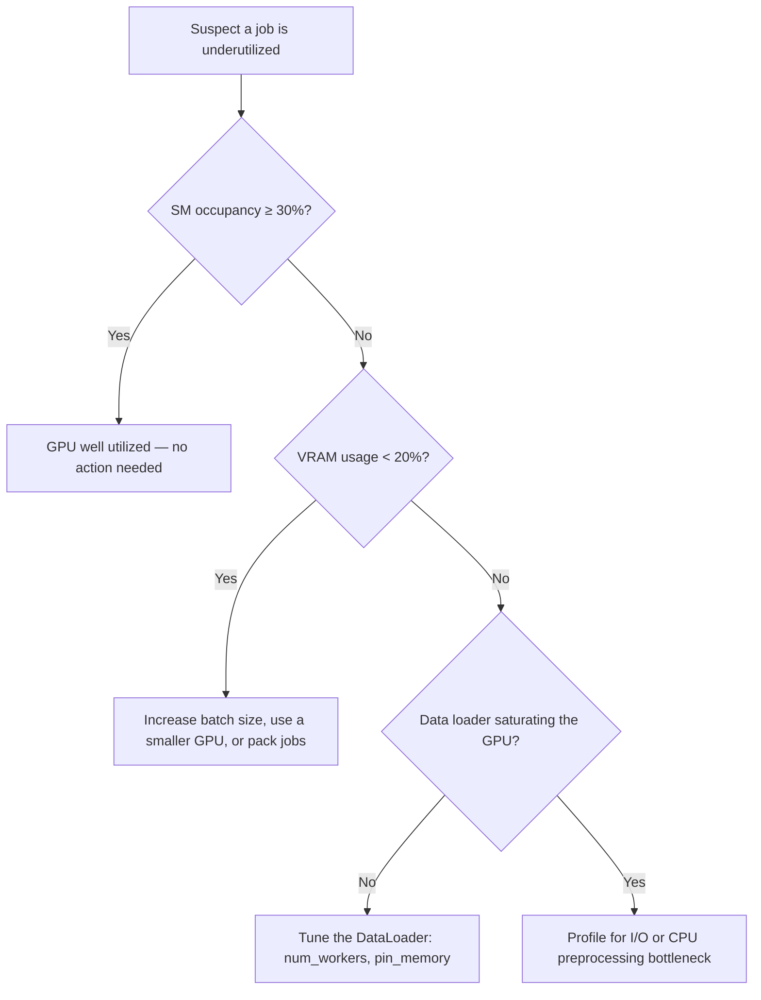

# Could My Job Run Faster? How to Identify GPU Waste

This guide explains how to read GPU efficiency metrics, diagnose an
underutilized job, and apply concrete best practices to improve throughput on
the Mila cluster.

## Before you begin

<div class="grid cards" markdown>

-   [:material-monitor:{ .lg .middle } __Monitor runs with WandB__](wandb.md)
    { .card }

    ---
    Track GPU utilization, CPU usage, and memory for a run.

-   [:material-server:{ .lg .middle } __Slurm basics__](slurm_guide/basics.md)
    { .card }

    ---
    Submit and allocate jobs on the cluster.

</div>

## What this guide covers

* Compute efficiency concepts: utilization vs. occupancy
* How to diagnose an underutilized job
* Best practices for efficient GPU use on the cluster

---

## Why GPU efficiency matters

Optimizing GPU usage directly accelerates research velocity. As compute power
at Mila is a shared resource, efficient jobs on the cluster bring a two-sided
advantage:

- **For the researcher:** Eliminating bottlenecks speeds up training times and
  helps unearth hidden bugs in data loaders or model architectures. With
  properly sized compute requests and efficient utilization, jobs start sooner
  and produce useful results faster.
- **For Mila:** Maximizing efficiency frees up cluster nodes, resulting in
  shorter queue times and more parallel experiments across the institute.

In other words, efficient compute utilization makes Mila research thrive.

## The basics of compute efficiency: utilization vs. occupancy

`nvidia-smi` is a useful first check, but its utilization metric has
limitations: it reports "100% Utilization" as soon as any kernel is running
on the GPU, regardless of how much of the hardware is actually in use. For a
more precise view, look at **Streaming Multiprocessor (SM) Occupancy**, which
measures what fraction of the GPU's computing units are actively working. More
context is available in this
[external post on GPU utilization metrics](https://www.trainy.ai/blog/gpu-utilization-misleading).

Use the table below as a reference to evaluate SM occupancy:

| SM Occupancy | Assessment |
|---|---|
| < 5% | Critical waste |
| ~10% | Poor utilization — the GPU is mostly waiting |
| ~30% | Good utilization |
| ≥ 50% | Great / optimized utilization |

## How to diagnose a job

Self-diagnosis is possible using these framework-agnostic methods. The
flowchart below outlines the decision path; Methods A and B explain how to read
the underlying numbers.



### Method A: Weights & Biases

In WandB, the **System** tab of a run shows data on GPU utilization, CPU
usage, and memory. See
[Diagnose training bottlenecks](wandb.md#diagnose-training-bottlenecks)
for details.

### Method B: The interactive check

During a job, `srun` into the allocated node and run a basic check:

```bash
# Check GPU utilization and power draw
nvidia-smi

# High power draw (Watts) is usually a good signal of active GPU utilization.
```

## Best practices for efficient GPU use

Even though situations are diverse, the following guidelines pave the way
for efficient GPU utilization.

!!! tip "Do — improve efficiency"
    - **Profile before scaling:** Run a test job with a profiler (WandB or
      TensorBoard) before launching large sweeps to ensure the data loader
      saturates the GPU.
    - **Optimize data pipelines:** Set `num_workers > 0` (2–4 per allocated
      GPU) and enable `pin_memory=True` in the PyTorch `DataLoader` to prevent
      GPU stalling.
    - **Implement checkpointing:** Save training states regularly so jobs
      resume automatically after preemption or timeouts without losing previous
      compute hours.
    - **Right-size resource requests:** Use
      [lower-tier nodes](../technical_reference/clusters/mila/nodes.md) (e.g.,
      RTX8000, V100) or MIG (Multi-Instance GPU) slices for small models or
      debugging instead of allocating full high-end nodes.
    - **Request minimal compute blocks:** When possible, request the smallest
      allocation that fits the job. Smaller allocations fill queue gaps faster,
      reducing wait time.

!!! warning "Don't — common pitfalls"
    - **Hoarding nodes:** Do not keep high-end GPUs (e.g., H100s) allocated on
      interactive partitions while away from the keyboard. Release them if not
      actively computing.
    - **Avoiding preemption queues:** Do not camp on non-preemptible partitions
      just to avoid writing checkpointing code — this tanks overall queue
      priority.
    - **Over-allocating CPU cores:** Do not request excessive CPU cores (e.g.,
      40 CPUs for 1 GPU) unless preprocessing explicitly requires it. Mila
      provides CPU-only nodes if needed.
    - **Scaling GPUs to fix I/O bottlenecks:** Do not add more GPUs if the
      pipeline is bottlenecked by storage read latency or CPU preprocessing —
      this only idles more hardware.
    - **Underutilizing VRAM:** If VRAM usage is under 20%, consider increasing
      batch size, switching to a smaller GPU, or using job packing (multiple
      smaller jobs on the same node).

---

## Key concepts

**SM Occupancy**
:   The fraction of a GPU's Streaming Multiprocessors (computing units) that
    are actively working. A more precise measure of GPU use than the
    `nvidia-smi` utilization metric.

**GPU Utilization**
:   The `nvidia-smi` metric that reports 100% as soon as any kernel runs on the
    GPU, regardless of how much hardware is in use. Useful as a first check but
    misleading on its own.

**MIG (Multi-Instance GPU)**
:   A feature that partitions a single GPU into smaller isolated slices, well
    suited to small models or debugging.

**VRAM**
:   The GPU's onboard memory. Low VRAM usage often signals room to increase
    batch size or move to a smaller GPU.

## Next steps

<div class="grid cards" markdown>

-   [:material-monitor:{ .lg .middle } __Diagnose training bottlenecks__](wandb.md#diagnose-training-bottlenecks)
    { .card }

    ---
    Use the WandB System tab to locate GPU, CPU, and I/O bottlenecks.

-   [:material-server:{ .lg .middle } __Right-size node requests__](../technical_reference/clusters/mila/nodes.md)
    { .card }

    ---
    Choose an appropriate node tier for the job.

</div>

## Get help

Questions are welcome on Slack (`#mila-cluster`, `#compute-canada`), or during
[Office Hours](https://docs.mila.quebec/help/office_hours/). The team is always
happy to provide early guidance or share thoughts on how to improve
experiments — in the interest of the community.

An LLM with [curated Mila cluster context](https://docs.mila.quebec/ai/) can
also help investigate and remove performance issues.
