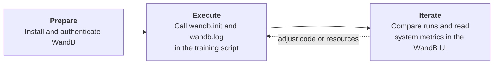

# Monitor and Optimize Experiments

Metrics turn a running job from a black box into something that can be
understood and improved. Without them, a slow, diverging, or wasteful
experiment looks exactly like a healthy one until it finishes, sometimes days
later. This page explains what to monitor, how to prepare metric collection
before the job starts, and which guide covers each tool available on the
cluster.

## What this guide covers

* The two goals of monitoring: model performance and resource usage
* Preparing metric collection across the three workflow phases
* Choosing a monitoring tool for each goal

---

## Why metrics matter

Monitoring serves two complementary goals. Both rely on metrics, but they
answer different questions and use different tools.

**Optimize the model**
:   Track loss, accuracy, and training speed (for example, samples per second
    or time per step) to decide whether a run converges, whether a
    hyperparameter change helps, and when to stop a run early.

**Optimize resource usage**
:   Track GPU utilization, SM occupancy, VRAM, CPU, and memory to verify that
    the requested resources are actually used. An under-utilized GPU slows the
    experiment and holds hardware that other researchers could use. See
    [Compute utilization at Mila](compute_utilization_guidelines/index.md) for
    what is expected of researchers.

The two goals are linked: a job that is I/O-bound wastes GPU time **and**
trains slower. Fixing the data pipeline improves both at once.

## Prepare metric collection before running

!!! warning "Metrics are only available if collection was prepared"
    Most metrics cannot be recovered after a job ends. Collecting them
    requires work in every phase of the workflow: the tool is installed during
    **Prepare**, called from the code during **Execute**, and the results are
    read and acted upon during **Iterate**.

Taking [Weights & Biases (WandB)](wandb.md) as an example, the three phases
look like this:

| Phase | What to do | Where to find it |
| ----- | ---------- | ---------------- |
| Prepare | Add the logging library to the project (`uv add wandb`) and authenticate once per cluster (`wandb login`). | [Manage Python Dependencies with `uv`](prepare/python_uv.md), [Authenticate the CLI on the cluster](wandb.md#authenticate-the-cli-on-the-cluster) |
| Execute | Initialize a run and log metrics inside the training loop. Optionally start a resource monitor such as `milalib` in the job. | [Initialize and log a training run](wandb.md#initialize-and-log-a-training-run), [Using milalib](../compute_utilization_guidelines/profiling/#method-b-weights-biases) |
| Iterate | Compare runs, read system metrics, and adjust the code or the resource request for the next job. | [Diagnose training bottlenecks](../compute_utilization_guidelines/profiling/#method-b-weights-biases) |

The same pattern applies to other tools: the
[PyTorch profiler](compute_utilization_guidelines/using_tensorboard_and_pytorch_profiler.md)
must be added to the code before the job runs for TensorBoard to display
anything afterwards.

!!! tip "Prepare for preemption as well"
    Setting the WandB run ID to the Slurm job ID and enabling
    [checkpointing](../examples/good_practices/checkpointing/index.md) lets a
    preempted job resume both its training state and its metric history.

## Monitor resource usage

Resource metrics come from several sources, from the job itself to
cluster-wide dashboards. The table below lists which tool answers which
question.

| Question | Tool | Guide |
| -------- | ---- | ----- |
| Is the job queued, running, or finished? How much memory and time did it use? | `squeue`, `sacct` | [Monitor and manage jobs](slurm_guide/monitor_manage.md) |
| How efficiently are my past jobs using GPUs? | Compute Utilization Dashboard | [Compute Utilization Dashboard](compute_utilization_guidelines/dashboard.md) |
| Is the GPU busy right now? Is the job I/O-bound? | `milalib`, `nvidia-smi`, WandB **System** tab | [Identifying GPU waste](compute_utilization_guidelines/profiling.md) |
| Which operations take the most time in the training loop? | PyTorch profiler and TensorBoard | [Visualizing usage with PyTorch profiler and TensorBoard](compute_utilization_guidelines/using_tensorboard_and_pytorch_profiler.md) |
| What is the state of a compute node? | Grafana | [Monitoring](../technical_reference/clusters/mila/monitoring.md) |

!!! tip "Profile before scaling"
    Run a short test job with monitoring enabled before launching a large
    sweep. Problems found on one job are cheaper to fix than problems repeated
    across a hundred.

## Next steps

-   [:material-chart-line:{ .lg .middle } __Track Experiments with WandB__](wandb.md)
    { .card }

    ---
    Set up WandB and log a first training run on the cluster.

-   [:material-lightning-bolt:{ .lg .middle } __Identifying GPU waste__](compute_utilization_guidelines/profiling.md)
    { .card }

    ---
    Diagnose under-utilized GPUs and apply best practices.

