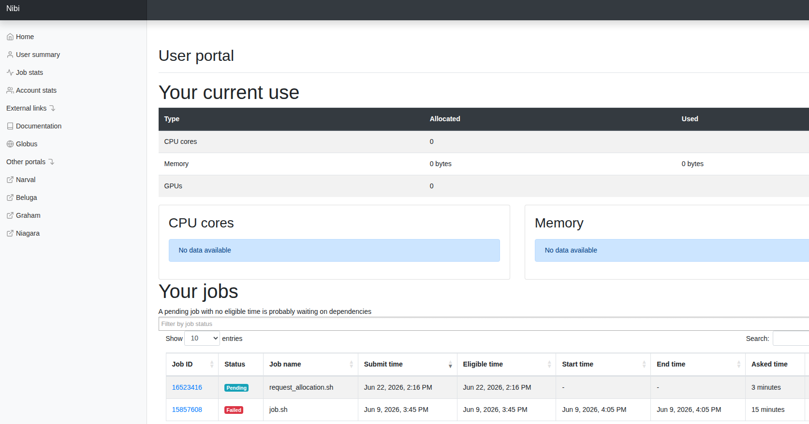

# Could my job run faster? How to identify GPU waste

## Why should you care about GPU efficiency?

Optimizing your GPU usage directly accelerates research velocity. As compute
power at Mila is a shared resource, efficient jobs on the cluster bring a
two-sided advantage:

- **For you:** Eliminating bottlenecks speeds up your training times and helps
  unearth hidden bugs in your data loaders or model architectures. With properly sized compute requests and efficient utilization, your jobs will be started sooner and will get useful results faster.
- **For Mila:** Maximizing efficiency frees up cluster nodes, resulting in
  shorter queue times and more parallel experiments across the institute.

In other words, efficient compute utilization makes Mila research thrive.

## The basics of compute efficiency: Utilization vs. Occupancy

`nvidia-smi` is a useful first check, but its utilization metric has
limitations: it reports "100% Utilization" as soon as any kernel is running
on the GPU, regardless of how much of the hardware is actually in use. For a
more precise view, look at **Streaming Multiprocessor (SM) Occupancy**, which
measures what fraction of the GPU's computing units are actively working. More
context is available in this
[external post on GPU utilization metrics](https://www.trainy.ai/blog/gpu-utilization-misleading).

Use the table below as a reference to evaluate your SM occupancy:

| SM Occupancy | Assessment |
|---|---|
| < 5% | Critical waste |
| ~10% | Poor utilization — the GPU is mostly waiting |
| ~30% | Good utilization |
| ≥ 50% | Great / optimized utilization |

## How to diagnose your jobs today?

You can self-diagnose using these framework-agnostic methods.

| Method | While job is running | After job has run |
| ------ | -------------------- | ----------------- |
| Weights&Biases | ✓ | ✓ |
| `nvidia-smi` command | ✓ |  |
| `nvidia-smi` log report |  | ✓ |
| Tensorboard visualization of Pytorch profiler data | ✓ | ✓ |
| Clusters portals | ✓ | ✓ |

### Method A: Weights & Biases

If you use WandB, go to the **System** tab of your run to find data on GPU
utilization, CPU usage, and memory. See
[Diagnose training bottlenecks](../../userguides/wandb.md#diagnose-training-bottlenecks)
for details.

### Method B: The interactive check

During a job, you can `srun` into your allocated node and run a basic check:

```bash
# Check GPU utilization and power draw
nvidia-smi

# High power draw (Watts) is usually a good signal of active GPU utilization.
```

### Method C: The NVSMI log

When a job has run on the cluster, an output file is created. Its default name is `slurm-<JOB_ID>.out`. This file contains the output of your experiment, along with a section NVSMI LOG containing metrics as the GPU and memory utilizations.

??? info "Example"
    
    ```
      ======== GPU REPORT ========

      ==============NVSMI LOG==============

      Timestamp                                              : Mon Jun  8 15:08:15 2026
      Driver Version                                         : 580.159.03
      CUDA Version                                           : 13.0

      Attached GPUs                                          : 2
      GPU 00000000:61:00.0
         Accounting Mode                                    : Enabled
         Accounting Mode Buffer Size                        : 4000
         Accounted Processes
            Process ID                                     : 3072883
                  GPU Utilization                            : 12 %
                  Memory Utilization                         : 3 %
                  Max memory usage                           : 998 MiB
                  Time                                       : 86816 ms
                  Is Running                                 : 0

      GPU 00000000:CA:00.0
         Accounting Mode                                    : Enabled
         Accounting Mode Buffer Size                        : 4000
         Accounted Processes
            Process ID                                     : 3072884
                  GPU Utilization                            : 15 %
                  Memory Utilization                         : 3 %
                  Max memory usage                           : 998 MiB
                  Time                                       : 86868 ms
                  Is Running                                 : 0

      Mon Jun  8 15:08:15 2026       
      +-----------------------------------------------------------------------------------------+
      | NVIDIA-SMI 580.159.03             Driver Version: 580.159.03     CUDA Version: 13.0     |
      +-----------------------------------------+------------------------+----------------------+
      | GPU  Name                 Persistence-M | Bus-Id          Disp.A | Volatile Uncorr. ECC |
      | Fan  Temp   Perf          Pwr:Usage/Cap |           Memory-Usage | GPU-Util  Compute M. |
      |                                         |                        |               MIG M. |
      |=========================================+========================+======================|
      |   0  NVIDIA L40S                    On  |   00000000:61:00.0 Off |                    0 |
      | N/A   35C    P0            105W /  325W |       0MiB /  46068MiB |      0%      Default |
      |                                         |                        |                  N/A |
      +-----------------------------------------+------------------------+----------------------+
      |   1  NVIDIA L40S                    On  |   00000000:CA:00.0 Off |                    0 |
      | N/A   36C    P0            102W /  325W |       0MiB /  46068MiB |      0%      Default |
      |                                         |                        |                  N/A |
      +-----------------------------------------+------------------------+----------------------+

      +-----------------------------------------------------------------------------------------+
      | Processes:                                                                              |
      |  GPU   GI   CI              PID   Type   Process name                        GPU Memory |
      |        ID   ID                                                               Usage      |
      |=========================================================================================|
      |  No running processes found                                                             |
      +-----------------------------------------------------------------------------------------+

      ======== GPU REPORT ========

      ==============NVSMI LOG==============

      Timestamp                                              : Mon Jun  8 15:08:15 2026
      Driver Version                                         : 580.159.03
      CUDA Version                                           : 13.0

      Attached GPUs                                          : 2
      GPU 00000000:61:00.0
         Accounting Mode                                    : Enabled
         Accounting Mode Buffer Size                        : 4000
         Accounted Processes
            Process ID                                     : 3072883
                  GPU Utilization                            : 12 %
                  Memory Utilization                         : 3 %
                  Max memory usage                           : 998 MiB
                  Time                                       : 86816 ms
                  Is Running                                 : 0

      GPU 00000000:CA:00.0
         Accounting Mode                                    : Enabled
         Accounting Mode Buffer Size                        : 4000
         Accounted Processes
            Process ID                                     : 3072884
                  GPU Utilization                            : 15 %
                  Memory Utilization                         : 3 %
                  Max memory usage                           : 998 MiB
                  Time                                       : 86868 ms
                  Is Running                                 : 0

      Mon Jun  8 15:08:16 2026       
      +-----------------------------------------------------------------------------------------+
      | NVIDIA-SMI 580.159.03             Driver Version: 580.159.03     CUDA Version: 13.0     |
      +-----------------------------------------+------------------------+----------------------+
      | GPU  Name                 Persistence-M | Bus-Id          Disp.A | Volatile Uncorr. ECC |
      | Fan  Temp   Perf          Pwr:Usage/Cap |           Memory-Usage | GPU-Util  Compute M. |
      |                                         |                        |               MIG M. |
      |=========================================+========================+======================|
      |   0  NVIDIA L40S                    On  |   00000000:61:00.0 Off |                    0 |
      | N/A   35C    P0            106W /  325W |       0MiB /  46068MiB |      0%      Default |
      |                                         |                        |                  N/A |
      +-----------------------------------------+------------------------+----------------------+
      |   1  NVIDIA L40S                    On  |   00000000:CA:00.0 Off |                    0 |
      | N/A   36C    P0            102W /  325W |       0MiB /  46068MiB |      0%      Default |
      |                                         |                        |                  N/A |
      +-----------------------------------------+------------------------+----------------------+

      +-----------------------------------------------------------------------------------------+
      | Processes:                                                                              |
      |  GPU   GI   CI              PID   Type   Process name                        GPU Memory |
      |        ID   ID                                                               Usage      |
      |=========================================================================================|
      |  No running processes found                                                             |
      +-----------------------------------------------------------------------------------------+
    ```

### Method D: Tensorboard visualization of Pytorch profiler data

* [Pytorch profiler](https://docs.pytorch.org/tutorials/recipes/recipes/profiler_recipe.html) is a tool measuring resources consumption of an experiment.
* [Tensorboard](https://www.tensorflow.org/tensorboard) is a visualization toolkit that can be used to log and display experiment usage.

!!! warning "Tensorboard should not be launched on login nodes"

An example of Tensorboard application on the cluster is described in the [Visualizing usage with Pytorch profiler and Tensorboard guide](../../userguides/profiling/using_tensorboard_and_pytorch_profiler).


### Method E: Clusters portals

Some clusters you have access to have a related portal which allows to display data and metrics, such as your use of the resources or a history of your jobs.

Here is a quick overview of the clusters and their associated portals (if applicable):

| Clusters | Maintainer | Portal |
| -------- | ---------- | ------ |
| [Mila](../../technical_reference/clusters/mila) | Mila | - |
| [TamIA](https://docs.alliancecan.ca/wiki/TamIA/en) | PAICE | [TamIA portal](https://portail.tamia.ecpia.ca/) |
| [Killarney](https://docs.alliancecan.ca/wiki/Killarney/en) | PAICE | - |
| [Vulcan](https://docs.alliancecan.ca/wiki/Vulcan/en) | PAICE | [Vulcan portal](https://portal.vulcan.alliancecan.ca/) |
| [Fir](https://docs.alliancecan.ca/wiki/Fir) | DRAC | - |
| [Nibi](https://docs.alliancecan.ca/wiki/Nibi) | DRAC | [Nibi portal](https://portal.nibi.sharcnet.ca/) |
| [Rorqual](https://docs.alliancecan.ca/wiki/Rorqual/en) | DRAC | [Rorqual portal](https://metrix.rorqual.calculquebec.ca/) |
| [Trillium](https://docs.alliancecan.ca/wiki/Trillium) | DRAC | [Trillium portal](https://my.scinet.utoronto.ca/) |





## Typical DOs and DON'Ts of compute efficiency

Even if situations are very diverse, the following guidelines pave the way for
efficient GPU utilization.

### ✅ DOs — To improve your runs

1. **Profile before scaling:** Run a test job with a profiler (WandB or
   TensorBoard) before launching large sweeps to ensure your data loader
   saturates the GPU.
2. **Optimize data pipelines:** Set `num_workers > 0` (2–4 per allocated GPU)
   and enable `pin_memory=True` in your PyTorch `DataLoader` to prevent GPU
   stalling.
3. **Implement checkpointing:** Save training states regularly so jobs can
   automatically resume after preemption or timeouts without losing previous
   compute hours.
4. **Right-size resource requests:** Use
   [lower-tier nodes](https://docs.mila.quebec/technical_reference/clusters/mila/nodes/)
   (e.g., RTX8000, V100) or MIG (Multi-Instance GPU) slices for small models
   or debugging instead of allocating full high-end nodes.
5. **Request minimal compute blocks:** When possible, request the smallest
   allocation that fits your job. Smaller allocations fill queue gaps faster,
   reducing your wait time.

### ❌ DON'Ts — Common pitfalls

1. **Hoarding nodes:** Do not keep high-end GPUs (e.g., H100s) allocated on
   interactive partitions while away from your keyboard. Release them if not
   actively computing.
2. **Avoiding preemption queues:** Do not camp on non-preemptible partitions
   just to avoid writing checkpointing code — this tanks your overall queue
   priority.
3. **Over-allocating CPU cores:** Do not request excessive CPU cores (e.g., 40
   CPUs for 1 GPU) unless your preprocessing explicitly requires it. Mila
   provides CPU-only nodes if needed.
4. **Scaling GPUs to fix I/O bottlenecks:** Do not add more GPUs if your
   pipeline is bottlenecked by storage read latency or CPU preprocessing — you
   will just idle more hardware.
5. **Underutilizing VRAM:** If your VRAM usage is under 20%, consider increasing
   batch size, switching to a smaller GPU or using job packing (multiple smaller
   jobs on the same node).

## Get help

If you have any questions, feel free to reach out on Slack
(`#mila-cluster`, `#compute-canada`), or drop by during
[Office Hours](https://docs.mila.quebec/help/office_hours/).
We are always happy to provide early guidance or share thoughts on how to
improve your experiments — in the interest of the community.

You can also use an LLM with
[curated Mila cluster context](https://docs.mila.quebec/ai/) to investigate
and remove obvious performance issues if you prefer to take matters into your
own hands.
