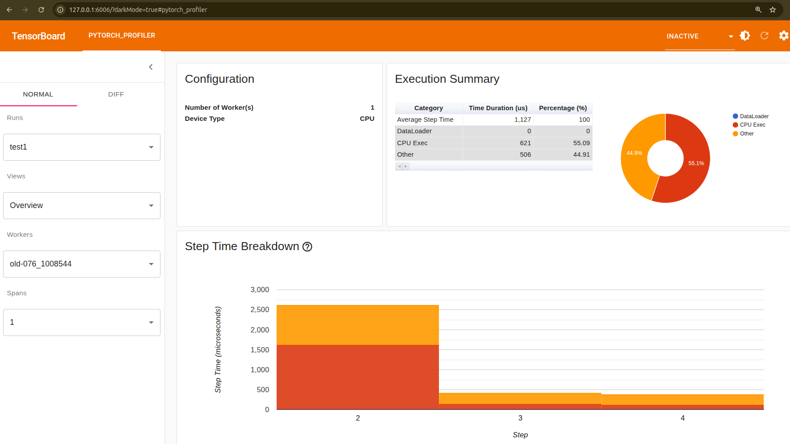

# Visualizing usage with Pytorch profiler and Tensorboard

This guide depicts a way to visualize metrics of jobs run on the cluster
by using the visualization toolkit [Tensorboard](https://www.tensorflow.org/tensorboard)
alongside [Pytorch profiler](https://docs.pytorch.org/tutorials/recipes/recipes/profiler_recipe.html).

## Before you begin

<div class="grid cards" markdown>

-   [:material-run-fast:{ .lg .middle } __Getting started with the Cluster__](../../getting_started/index.md)
    { .card }

    ---
    Get your Mila account, enable cluster access and MFA, then install `uv` and
    `milatools` to connect via SSH.


-   [:material-lightbulb-alert-outline:{ .lg .middle } __Understanding Slurm__](../slurm_guide/basics.md)
    { .card }

    ---
    Ask for a resource allocation and launch tasks on the cluster through an interactive job.


-   [:material-language-python:{ .lg .middle } __Managing Python Dependencies with `uv`__](../python_uv.md)
    { .card }

    ---
    Install uv, manage project dependencies, run reproducible Slurm jobs, and run
    standalone scripts.


-   [:material-magnify:{ .lg .middle } __Identifying GPU waste__](index.md)
    { .card }

    ---
    Introduce the notion of profiling.

&nbsp;

</div>

## What this guide covers
* Introduce Pytorch profiler and Tensorboard to log and display metrics
* Launch Tensorboard alongside jobs on the cluster

---

## Description of the process

TensorBoard reads profiling data from a directory that you specify when launching it.
Visualizing a job's performance with TensorBoard involves two steps:

1. **Recording profiling data:** PyTorch Profiler writes trace files to the directory during the job's execution.
2. **Viewing the metrics:** TensorBoard is launched pointing to that directory, either while the job is still running or after it has finished.

## Recording profiling data

??? info
    This guide is based on the following guides from the Pytorch documentation:

    * [How to use TensorBoard with PyTorch](https://docs.pytorch.org/tutorials/recipes/recipes/tensorboard_with_pytorch.html)
    * [Pytorch profiler with Tensorboard](https://colab.research.google.com/github/pytorch/tutorials/blob/gh-pages/_downloads/50d8e1e8ecc86503893ab8f9f52932ba/tensorboard_profiler_tutorial.ipynb)

    You can refer to them for more details.


### Base code
The following code is an example of training a model with Pytorch:
```python
import torch

# Linear regression training example
x = torch.arange(-5, 5, 0.1).view(-1, 1)
y = -5 * x + 0.1 * torch.randn(x.size())

model = torch.nn.Linear(1, 1)
criterion = torch.nn.MSELoss()
optimizer = torch.optim.SGD(model.parameters(), lr = 0.1)

def train_model(iter):
    for epoch in range(iter):
        y1 = model(x)
        loss = criterion(y1, y)
        optimizer.zero_grad()
        loss.backward()
        optimizer.step()

train_model(10)
```

### How to use Pytorch profiler

Metrics are written with `profile` from the `torch.profiler`
library. Below is a template to understand how to add it to
a model training code:

```python
import os
from pathlib import Path

# Import Pytorch profiler
import torch.profiler

# Define in which folder we want the results to be stored
SCRATCH = Path(os.environ.get("SCRATCH", "fake_scratch"))
SLURM_JOB_ID = os.environ.get("SLURM_JOB_ID", "0")

logs_dir = SCRATCH / "logs" / SLURM_JOB_ID
logs_dir.mkdir(parents=True, exist_ok=True)

# Initialize the profiler
profiler = torch.profiler.profile(
    schedule=torch.profiler.schedule(wait=1, warmup=1, active=3, repeat=2),
    on_trace_ready=torch.profiler.tensorboard_trace_handler(logs_dir),
    record_shapes=True,
    with_stack=True,
)

# Start the profiler
profiler.start()


# Train the model
[...]


# Training loop:
    # Write the metrics while training the model
    profiler.step()

[...]


# Stop the profiler when you do not need it anymore
profiler.stop()
```

### Ready-for-use code
Below is an example of putting it all together. It is ready to be run:

=== "experiment.py"
    ```python
    --8<-- "docs/userguides/profiling/code/experiment.py"
    ```


## Try the example locally

Launching the example locally is done through the following steps:

1. Write the experiment code
2. Set up the environment
3. Launch the experiment
4. Launch Tensorboard
5. Access Tensorboard visualization

### Write the experiment code
We use the code explained in [the previous section](#ready-for-use-code).

### Set up the environment
The environment is described in the following file. Copying it as `pyproject.toml` would make available all the prerequisites
while running the `uv` command.

=== "pyproject.toml"
    ```toml
    --8<-- "docs/userguides/profiling/code/pyproject.toml"
    ```

### Launch the experiment
Once the two files (`experiment.py` and `pyproject.toml`) have been written in your environment, you can
launch the experiment through the following command:
```console
uv run python experiment.py
```

The folder `fake_scratch/logs/0` has been created.


### Launch Tensorboard
Tensorboard can be launched whether the job is running or has ended, this is done through the command:
```console
uv run tensorboard --logdir=fake_scratch/logs/0
```

<div class="result" style="border:None; padding:0" markdown>
``` linenums="0"
Serving TensorBoard on localhost; to expose to the network, use a proxy or pass --bind_all
TensorBoard 2.20.0 at http://localhost:6006/ (Press CTRL+C to quit)
```
</div>

### Access Tensorboard visualization
You can access Tensorboard interface through localhost, the default port is `6006`. To this end, open a browser and enter `127.0.0.1:6006` in the address bar.

The following dashboard appears:



## Launch this example on the cluster

Now is time to launch a job on the cluster and benefit the shared compute resources to run experiments.
Below are described two methods to visualize metrics of a job on the cluster:

* Using milatools and VSCode
* Using command lines.

### Steps overview

=== "milatools and VSCode"
    1. From a local terminal : `ssh mila 'mkdir -p CODE/tensorboard_test'`
    2. From a local terminal : `mila code CODE/tensorboard_test --alloc --gres=gpu:1 --cpus-per-task=2 --mem=16G --time=01:00:00`
    3. In VSCode : create the files `experiment.py` and `pyproject.toml`
    4. From the VSCode terminal : `uv run python experiment.py`
    5. From the browser, access Tensorboard [on browser](http://127.0.0.1:6006).

=== "Command lines"
    1. Connect to the cluster : `ssh mila`
    2. Set up the project for the cluster : `mkdir $SCRATH/tensorboard_test`, `cd $SCRATCH/tensorboard_test`, `vim experiment.py`, `vim pyproject.toml`
    3. Launch the experiment : `vim job.sh` and `sbatch job.sh`
    4. Launch Tensorboard : `salloc ` then `uvx tensorboard --logdir $SCRATCH/logs/$SLURM_JOB_ID`
    5. From the browser, access Tensorboard [on browser](http://127.0.0.1:6006).


### Detailed steps

=== "milatools and VSCode"

    <span class="tab-title">Create directory and allocate resources</span>

    From your **local terminal**, create the project directory on the cluster and launch VSCode connected directly to an allocated compute node:

    ```console
    ssh mila 'mkdir -p CODE/tensorboard_test'
    mila code CODE/tensorboard_test --alloc --gres=gpu:1 --cpus-per-task=2 --mem=16G --time=01:00:00
    ```

    !!! info "What `mila code` does"
        `mila code` requests an interactive Slurm allocation on a compute node and automatically opens a VSCode remote session attached to that node.

    <span class="tab-title">Create the experiment files</span>

    Once VSCode launches and connects to the cluster node:

    1. Open the File Explorer (`Ctrl+Shift+E` / `Cmd+Shift+E` / View -> Explorer).
    2. Create `experiment.py` and `pyproject.toml` using the templates from the [Ready-for-use code](#ready-for-use-code) section.

    <span class="tab-title">Run the experiment</span>

    Open the integrated VSCode terminal ( View -> Terminal ) and start the experiment:

    ```console
    uv run python experiment.py
    ```

    This will generate performance trace logs inside `$SCRATCH/logs/$SLURM_JOB_ID`.

    <span class="tab-title">Launch TensorBoard</span>

    !!! warning "Do not launch Tensorboard on the login node"
        Login nodes exist for light interactive tasks. TensorBoard must be run on a compute node to avoid overloading login nodes for other users.

    In the **VSCode terminal**, run TensorBoard using `uvx`:

    ```console
    uvx tensorboard --logdir $SCRATCH/logs/$SLURM_JOB_ID
    ```

    <span class="tab-title">Access TensorBoard visualization</span>

    VSCode automatically detects listening network ports on the compute node and forwards them to your local machine.

    Open your local web browser and navigate to:
    [http://127.0.0.1:6006](http://127.0.0.1:6006)

=== "Command lines"

    <span class="tab-title">Connect to the cluster</span>

    Connect to a login node from your local terminal:

    ```console
    ssh mila
    ```

    <span class="tab-title">Set up the project directory and files</span>

    Create your project directory under `$SCRATCH` and navigate into it:

    ```console
    mkdir -p $SCRATCH/tensorboard_test
    cd $SCRATCH/tensorboard_test
    ```

    Create `experiment.py` and `pyproject.toml` (using a text editor like `vim` or `nano`) based on the code provided in [Ready-for-use code](#ready-for-use-code).

    <span class="tab-title">Launch the experiment</span>

    Create a Slurm job script named `job.sh`:

    === "job.sh"
        ```bash
        --8<-- "docs/userguides/profiling/code/job.sh"
        ```

    Submit the job to Slurm:

    ```console
    sbatch job.sh
    ```

    Take note of the Job ID printed in your terminal output (e.g., `Submitted batch job 1234567`).

    <span class="tab-title">Launch TensorBoard</span>

    !!! warning "Do not launch Tensorboard on the login node"
        Always launch TensorBoard inside a compute node allocation.

    Request an interactive allocation on a compute node, then start TensorBoard:

    ```console
    salloc --cpus-per-task=2 --mem=4G --time=01:00:00
    uvx tensorboard --logdir $SCRATCH/logs/<JOB_ID>
    ```
    *(Replace `<JOB_ID>` with the actual ID of your experiment job).*

    Next, establish an SSH tunnel in a **new tab on your local terminal**:

    ```console
    ssh -L 6006:localhost:6006 <NODE_NAME>.server.mila.quebec
    ```
    *(Replace `<NODE_NAME>` with the compute node name assigned to your `salloc` job.)*

    ???tip "Node name"
      An example of a node name is `cn-f003`. A list of the Mila cluster's nodes
      can be found in [the Mila cluster nodes pages](../../technical_reference/clusters/mila/nodes.md).

    <span class="tab-title">Access TensorBoard visualization</span>

    Open your local browser and navigate to:
    [http://127.0.0.1:6006](http://127.0.0.1:6006)

    !!! tip "Changing ports"
        If port `6006` is already occupied on your machine, specify `--port <PORT>` when running TensorBoard and update your SSH forwarding rule accordingly.

---

## Key concepts

SSH port forwarding
:   Also called "SSH tunneling", it is an operation where a machine listens on a specific port, and transfers it to a (potentially other port) on another machine. [More info here](https://www.ssh.com/academy/ssh/tunneling)
