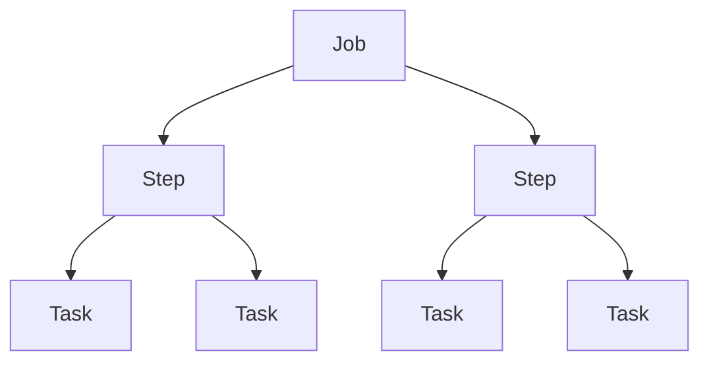

# Understanding Slurm

## Before you begin

<div class="grid cards" markdown>

-   [:material-run-fast:{ .lg .middle } __Get Started with the Cluster__](../../getting_started/index.md)
    { .card }

    ---
    Obtain a Mila account, enable cluster access and MFA, install `uv` and
    `milatools`, configure SSH access and connect to the cluster for the first
    time.

&nbsp;

</div>

## What this guide covers

* Discovering Slurm jobs, steps and tasks
* Launching multiple tasks through an interactive job
* Launching multiple tasks from a script

---

## Slurm concepts

### Jobs, steps and tasks

The recurrent entities in Slurm are jobs, steps and tasks. As a simple mental
model:

* a job can have multiple steps
* a step can run multiple tasks.



See the [technical reference](../../technical_reference/general_theory/slurm.md#some-definitions)
for deeper information.

### Login nodes and compute nodes

These concepts are explained in detail in
[What is a computer cluster?](../../technical_reference/general_theory/cluster_parts.md).
In short, two types of nodes matter here:

| Type of node | Use |
| ------------ | --- |
| Login node   | Used to connect to the cluster and manage jobs |
| Compute node | Where jobs run; the allocation requested when a job is launched is provided from them |

??? warning "Do not run jobs on login nodes"
    Login nodes are entry points to the cluster. Slurm commands (`sbatch`,
    `sinfo`, `squeue`, etc.) can be called from there, but computing scripts
    must be submitted through Slurm to obtain the requested resources, rather
    than run directly on the login nodes.

### Commands

This guide focuses on three Slurm commands:

| Command  | Entity created | Description | Where to call it |
| -------- | -------------- | ----------- | ---------------- |
| `sbatch` | Batch Slurm job | Submit a batch script to Slurm | From a login node |
| `salloc` | Interactive job | Obtain a Slurm job allocation (a set of nodes), execute a command, and then release the allocation when the command is finished | From a login node |
| `srun`   | Step :material-information-outline:{ title="srun can also be used to directly submit jobs, but this is not recommended" } | Run tasks | From a job |

Submitting tasks is done through two steps:

1. Request a resource allocation by submitting a job (`sbatch` or `salloc`).
2. Launch commands as tasks within this resource allocation (`srun`).

## Discover Slurm through an interactive job

### Connect to the cluster

See [Verify your connection](../../getting_started/index.md#verify-your-connection)
for more information on connecting.

=== "Steps"

    Open a terminal and launch the command:
    ```bash
    ssh mila
    ```

=== "More details"

    This example connects to the Mila cluster. The command `ssh mila` works
    thanks to the configuration set in `~/.ssh/config`, which can be created by
    `mila init` (see [the Getting Started guide](../../getting_started/index.md)).

### Submit a job

=== "Steps"

    Submitting a job is like booking an allocation: it requests the desired
    resources (GPU, CPU, nodes, memory) and sets the experiment conditions. The
    Slurm scheduler is then in charge of providing an allocation.

    ```bash
    salloc --ntasks=4 --nodes=2 --mem=2G --time=00:30:00
    ```
    <div class="result" style="border:None; padding:0" markdown>
    ``` linenums="0"
    salloc: --------------------------------------------------------------------------------------------------
    salloc: # Using default long-cpu partition (CPU-only)
    salloc: --------------------------------------------------------------------------------------------------
    salloc: Pending job allocation 9311988
    salloc: job 9311988 queued and waiting for resources

    salloc: Granted job allocation 9311988
    salloc: Nodes cn-f[001-002] are ready for job
    ```
    </div>

    Once the allocation is granted, Slurm reports some information about the
    job:

    * the Job ID (9311988 in this example)
    * the nodes the allocation runs on (cn-f001 and cn-f002 in this example).

    The resource allocation is now ready.

=== "More details"

    * `salloc` means this is an interactive job
    * `--ntasks` means that `srun` invokes 4 tasks
    * `--nodes` means 2 nodes are requested for the previously mentioned tasks
      to run on
    * `--mem` specifies the real memory required per node. `--mem-per-gpu` or
      `--mem-per-cpu` can be used instead
    * `--time` asks for a 30-minute allocation. Setting it is good practice: an
      interactive job can last up to a week, and forgetting to leave one is a
      common mistake.

    See [salloc documentation](https://slurm.schedmd.com/salloc.html) for more
    information.

### Inspect where tasks run

=== "Steps"

    Running `hostname` reports where the process calling the command runs:

    ```bash
    hostname
    ```
    <div class="result" style="border:None; padding:0" markdown>
    ``` linenums="0"
    cn-f001.server.mila.quebec
    ```
    </div>

    Running steps and tasks is done with `srun`:

    ```bash
    srun hostname
    ```
    <div class="result" style="border:None; padding:0" markdown>
    ``` linenums="0"
    cn-f002.server.mila.quebec
    cn-f002.server.mila.quebec
    cn-f002.server.mila.quebec
    cn-f001.server.mila.quebec
    ```
    </div>

    Each task returned its own result for the `hostname` command.

    In this example:

    * three tasks ran on the node `cn-f002`
    * one task ran on the node `cn-f001`

    !!! tip
        For more symmetrical jobs, use the `--ntasks-per-node` parameter instead
        of `--ntasks`.

        (For instance, `--ntasks-per-node=2` in this case.)

=== "More details"

    * Note on the command:
        * `srun hostname` follows the format `srun <command>`. `srun` can also
          take parameters, in the format `srun <parameters> <command>`. See
          [srun documentation](https://slurm.schedmd.com/srun.html) for more
          details.

    * Notes on the result:
        * The `hostname` command ran four times because four tasks were
          requested when submitting the job through `salloc`.
        * The four tasks run by `srun` are not necessarily evenly spread among
          the nodes.

## Launch a non-interactive job

This section reproduces the same example as before (same parameters and same
command, `hostname`) and submits the job through the `sbatch` command.

### Connect to the cluster

```bash
ssh mila
```

### Write the script

=== "Steps"
    The script can be created in one of two ways:

    * Directly on the login node (in the `$SCRATCH` directory or its
      subdirectories):
        ```bash
        cd $SCRATCH
        vim job.sh
        ```
    * On a local computer, then copied to the scratch directory:
        ```bash
        scp job.sh mila:/network/scratch/s/user.name
        ```

        replacing `user.name` with the actual username.

    The content of `job.sh` is:

    ```bash
    #!/bin/bash
    #SBATCH --ntasks=4
    #SBATCH --nodes=2
    #SBATCH --mem=2G
    #SBATCH --time=00:00:05

    hostname
    ```

=== "More details"
    The script begins with the same parameters used with `salloc` for the
    interactive job.

### Submit the job

From the login node, run:

```bash
sbatch job.sh
```
<div class="result" style="border:None; padding:0" markdown>
``` linenums="0"
sbatch: --------------------------------------------------------------------------------------------------
sbatch: # Using default long-cpu partition (CPU-only)
sbatch: --------------------------------------------------------------------------------------------------
Submitted batch job 9321166
```
</div>

Once submitted, the job waits to be scheduled. Its status is shown by the
[`squeue`](https://slurm.schedmd.com/squeue.html) command:

```bash
squeue --me
```
<div class="result" style="border:None; padding:0" markdown>
``` linenums="0"
JOBID     USER    PARTITION           NAME  ST START_TIME             TIME NODES CPUS TRES_PER_N MIN_MEM NODELIST (REASON) COMMENT
9321166 user.name long-cpu,lon      job.sh  PD N/A                    0:00     2    4        N/A      2G  (Priority) (null)
```
</div>

The allocation is requested by `sbatch` based on the script parameters. Once it
is ready, the script runs automatically (the job is running), and the allocation
is freed at the end of the job.

### Retrieve the results

Once the job is finished, its output is available in the file
`slurm-<JOB_ID>.out` (here, `slurm-9321166.out`). The file name can be changed
with the [`--output`](https://slurm.schedmd.com/sbatch.html#OPT_output)
parameter.

The output in this example is:
<div class="result" style="border:None; padding:0" markdown>
``` linenums="0"
cn-f001.server.mila.quebec
cn-f001.server.mila.quebec
cn-f002.server.mila.quebec
cn-f002.server.mila.quebec
```
</div>

---

## Key concepts

Job
:   Global commands executed in a requested resource allocation.

Task
:   Set of commands running on part of an allocation. A job can contain multiple
    tasks.

## Next step

With multiple commands (such as `hostname`) running in a Slurm job — each with
its own resources and environment variables — the next step covers the
fundamentals of distributed programs such as distributed training in PyTorch.

<div class="grid cards" markdown>

-   [:material-shuffle-variant:{ .lg .middle } __Synchronizing multiple tasks__](tasks_communication.md)
    { .card }

    ---
    Synchronize the output of multiple tasks running on different nodes.

&nbsp;

</div>
