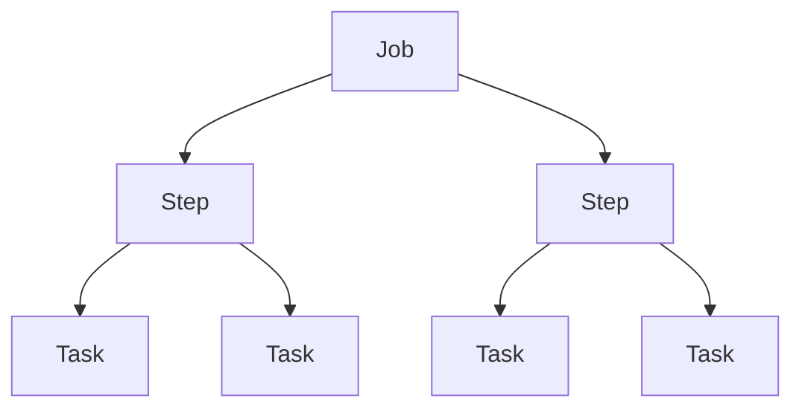

# Understand Slurm

This guide introduces the core Slurm entities — jobs, steps and tasks — and
puts them into practice: request an interactive allocation, run tasks on it
with `srun`, then reproduce the same example as a batch job with `sbatch`.

## Before you begin

<div class="grid cards" markdown>

-   [:material-run-fast:{ .lg .middle } __Get Started with the Cluster__](../../getting_started/index.md)
    { .card }

    ---
    Obtain a Mila account, enable cluster access and MFA, install `uv` and
    `milatools`, configure SSH access and connect to the cluster for the first
    time.

&nbsp;

</div>

## What this guide covers

* Discovering Slurm jobs, steps and tasks
* Launching multiple tasks through an interactive job
* Launching multiple tasks from a script

---

## Slurm concepts

### Jobs, steps and tasks

The recurrent entities in Slurm are jobs, steps and tasks. As a simple mental
model:

* a job can have multiple steps
* a step can run multiple tasks.



See the [technical reference](../../technical_reference/general_theory/slurm.md#some-definitions)
for deeper information.

### Login nodes and compute nodes

These concepts are explained in detail in
[What is a computer cluster?](../../technical_reference/general_theory/cluster_parts.md).
In short, two types of nodes matter here:

| Type of node | Use |
| ------------ | --- |
| Login node   | Used to connect to the cluster and manage jobs |
| Compute node | Where jobs run; provides the resources requested by a job |

???+ warning "Do not run jobs on login nodes"
    Login nodes are entry points to the cluster. Slurm commands (`sbatch`,
    `sinfo`, `squeue`, etc.) can be called from there, but computing scripts
    must be submitted through Slurm to obtain the requested resources, rather
    than run directly on the login nodes.

### Commands

This guide focuses on three Slurm commands:

| Command  | Entity created | Description | Where to call it |
| -------- | -------------- | ----------- | ---------------- |
| `sbatch` | Batch Slurm job | Submit a batch script to Slurm | From a login node |
| `salloc` | Interactive job | Obtain a Slurm job allocation (a set of nodes), execute a command, and then release the allocation when the command is finished | From a login node |
| `srun`   | Step :material-information-outline:{ title="srun can also be used to directly submit jobs, but this is not recommended" } | Run tasks | From a job |

Submitting tasks takes two steps:

1. Request a resource allocation by submitting a job (`sbatch` or `salloc`).
2. Launch commands as tasks within this resource allocation (`srun`).

## Discover Slurm through an interactive job

An interactive job opens a shell directly on the allocated compute nodes. With
VSCode, a single `mila code` command both connects to the cluster and requests
the allocation. The equivalent terminal workflow connects first with `ssh
mila`, then requests the allocation with `salloc`.

### Request an interactive allocation

=== "VSCode"

    Open the project on a compute node, passing the allocation options after
    `--salloc` (everything after `--salloc` is forwarded to Slurm):

    ```bash
    mila code --salloc --nodes=2 --ntasks-per-node=2 --mem=2G --time=00:30:00
    ```
    <div class="result" style="border:None; padding:0" markdown>
    ``` linenums="0"
    [17:35:21] Checking disk quota on $HOME...                                                                                                disk_quota.py:31
    [17:35:27] Disk usage: 85.34 / 100.00 GiB and 794022 / 1048576 files                                                                      disk_quota.py:211
    [17:35:29] (mila) $ cd $SCRATCH && salloc --nodes=2 --ntasks-per-node=2 --mem=2G --time=00:30:00 --job-name=mila-code                    compute_node.py:293
    salloc: --------------------------------------------------------------------------------------------------
    salloc: # Using default long-cpu partition (CPU-only)
    salloc: --------------------------------------------------------------------------------------------------
    salloc: Granted job allocation 8888888
    [17:35:30] Waiting for job 8888888 to start.                                                                                              compute_node.py:315
    [17:35:31] (localhost) $ code --new-window --wait --remote ssh-remote+cn-f001.server.mila.quebec /home/mila/u/username/                   local_v2.py:55
    ```
    </div>

    VSCode opens connected to the first allocated node. Open the integrated
    terminal (**Terminal → New Terminal**) to run commands on the allocation.

=== "Terminal"

    Connect to the cluster:

    ```bash
    ssh mila
    ```

    Then request the allocation. The Slurm scheduler provides it once the
    resources are available:

    ```bash
    salloc --nodes=2 --ntasks-per-node=2 --mem=2G --time=00:30:00
    ```
    <div class="result" style="border:None; padding:0" markdown>
    ``` linenums="0"
    salloc: --------------------------------------------------------------------------------------------------
    salloc: # Using default long-cpu partition (CPU-only)
    salloc: --------------------------------------------------------------------------------------------------
    salloc: Pending job allocation 8888888
    salloc: job 8888888 queued and waiting for resources

    salloc: Granted job allocation 8888888
    salloc: Nodes cn-f[001-002] are ready for job
    ```
    </div>

Once the allocation is granted, Slurm reports the Job ID (8888888 in this
example) and the nodes the allocation runs on (cn-f001 and cn-f002). The
resource allocation is now ready.

??? info "What the allocation flags mean"
    * `--nodes` means 2 nodes are requested for the tasks to run on
    * `--ntasks-per-node` means each node runs 2 tasks, so `srun` invokes
      4 tasks in total
    * `--mem` specifies the real memory required per node. `--mem-per-gpu` or
      `--mem-per-cpu` can be used instead
    * `--time` asks for a 30-minute allocation. Setting it is good practice: an
      interactive job can last up to a week, and forgetting to leave one is a
      common mistake.

    Both workflows request the same interactive allocation. `mila code --salloc`
    runs the same `salloc` under the hood, as shown in its output.

    See the [salloc documentation](https://slurm.schedmd.com/salloc.html) for
    more information.

### Inspect where tasks run

Run the following in the shell on the allocation — the VSCode integrated
terminal, or the `salloc` session in the terminal workflow.

Running `hostname` reports where the process calling the command runs:

```bash
hostname
```
<div class="result" style="border:None; padding:0" markdown>
``` linenums="0"
cn-f001.server.mila.quebec
```
</div>

Run steps and tasks with `srun`:

```bash
srun hostname
```
<div class="result" style="border:None; padding:0" markdown>
``` linenums="0"
cn-f002.server.mila.quebec
cn-f001.server.mila.quebec
cn-f002.server.mila.quebec
cn-f001.server.mila.quebec
```
</div>

Each task returned its own result for the `hostname` command.

In this example:

* two tasks ran on the node `cn-f001`
* two tasks ran on the node `cn-f002`

??? info "`--ntasks`: requesting a total instead of a shape"
    The same four tasks can be requested with `--ntasks=4 --nodes=2`, which
    fixes only the total and lets Slurm spread the tasks unevenly — for
    example, three tasks on one node and one on the other:

    ``` linenums="0"
    cn-f002.server.mila.quebec
    cn-f002.server.mila.quebec
    cn-f002.server.mila.quebec
    cn-f001.server.mila.quebec
    ```

    `--ntasks-per-node` is the safe default for deep learning and GPU jobs:

    * each process selects its GPU based on its local rank, and a node that
      receives more tasks than GPUs breaks that binding
    * `--mem` is allocated per node, so an extra task on a node shrinks the
      memory available to each task running there
    * the placement is identical on every run, which keeps failures
      reproducible

??? info "More details on `srun` and task placement"
    * Note on the command:
        * `srun hostname` follows the format `srun <command>`. `srun` can also
          take parameters, in the format `srun <parameters> <command>`. See
          [srun documentation](https://slurm.schedmd.com/srun.html) for more
          details.

    * Notes on the result:
        * The `hostname` command ran four times because the allocation
          requests four tasks in total (2 nodes × 2 tasks per node).
        * The tasks on a node do not finish in a fixed order, so the node
          names may appear interleaved in the output.

## Launch a non-interactive job

This section reproduces the same example as before (same parameters and same
command, `srun hostname`) and submits the job through the `sbatch` command.

### Connect to the cluster

=== "VSCode"

    Open the project on the cluster with `mila code`, or pick `mila-cpu` in the
    Remote-SSH dropdown for a light editing session. See
    [VSCode](../../toolbox/VSCode.md).

=== "Terminal"

    ```bash
    ssh mila
    ```

### Write the script

=== "VSCode"

    In the VSCode explorer, browse to `$SCRATCH` (or a subdirectory) and create
    `job.sh` directly on the cluster.

=== "Terminal"

    Create the script in `$SCRATCH` on a login node:

    ```bash
    cd $SCRATCH
    vim job.sh
    ```

The content of `job.sh` is the same in both cases. It begins with the same
parameters used to request the interactive allocation:

```bash
#!/bin/bash
#SBATCH --nodes=2
#SBATCH --ntasks-per-node=2
#SBATCH --mem=2G
#SBATCH --time=00:30:00

srun hostname
```

The batch script itself runs once, on the first allocated node; the `srun`
call launches the four tasks, exactly as in the interactive example.

### Submit the job

In the VSCode integrated terminal (or a login-node terminal), submit the job:

```bash
sbatch job.sh
```
<div class="result" style="border:None; padding:0" markdown>
``` linenums="0"
sbatch: --------------------------------------------------------------------------------------------------
sbatch: # Using default long-cpu partition (CPU-only)
sbatch: --------------------------------------------------------------------------------------------------
Submitted batch job 9321166
```
</div>

Once submitted, the job waits to be scheduled. Its status is shown by the
[`squeue`](https://slurm.schedmd.com/squeue.html) command:

```bash
squeue --me
```
<div class="result" style="border:None; padding:0" markdown>
``` linenums="0"
JOBID     USER    PARTITION           NAME  ST START_TIME             TIME NODES CPUS TRES_PER_N MIN_MEM NODELIST (REASON) COMMENT
9321166 user.name long-cpu,lon      job.sh  PD N/A                    0:00     2    4        N/A      2G  (Priority) (null)
```
</div>

The allocation is requested by `sbatch` based on the script parameters. Once it
is ready, the script runs automatically (the job is running), and the allocation
is freed at the end of the job.

### Retrieve the results

Once the job is finished, its output is available in the file
`slurm-<JOB_ID>.out` (here, `slurm-9321166.out`). The file name can be changed
with the [`--output`](https://slurm.schedmd.com/sbatch.html#OPT_output)
parameter.

The output in this example is:
<div class="result" style="border:None; padding:0" markdown>
``` linenums="0"
cn-f001.server.mila.quebec
cn-f001.server.mila.quebec
cn-f002.server.mila.quebec
cn-f002.server.mila.quebec
```
</div>

---

## Key concepts

Job
:   A resource allocation on the cluster, together with the steps that run
    inside it. Created by `sbatch` or `salloc`.

Step
:   A stage within a job, created by a call to `srun`. A job can contain
    multiple steps, and each step can launch multiple tasks.

Task
:   One instance of a command run by a step on part of the job's allocation.
    A step can run multiple tasks.

`mila code`
:   `milatools` command that requests an allocation and opens VSCode on the
    compute node. Options passed after `--salloc` are forwarded to Slurm.

`mila-cpu`
:   SSH remote added by `mila init` that auto-allocates a CPU compute node for
    light editing from the VSCode Remote-SSH dropdown.

## Next step

With a job submitted through `salloc` or `sbatch`, the next step covers how to
follow it through the queue, inspect and cancel it, and resolve common failures.

<div class="grid cards" markdown>

-   [:material-monitor-eye:{ .lg .middle } __Monitor and manage jobs__](monitor_manage.md)
    { .card }

    ---
    Track jobs through the queue, inspect and cancel them, read their output,
    and resolve common failures.

&nbsp;

</div>
