# Submit Jobs Across Clusters with cluv

[cluv](https://mila-iqia.github.io/cluv/) is a lightweight command-line tool
for syncing UV-based Python projects and submitting jobs across multiple Slurm
clusters, including the Mila cluster.

Many Mila researchers also hold compute allocations on other Slurm clusters,
such as the [DRAC clusters](../../technical_reference/clusters/index.md).
Moving a project between clusters by hand can be tedious and error-prone,
especially when synchronizing code, dependencies, datasets, and results.
`cluv` automates this process, allowing development to happen locally while
jobs run on any cluster and getting access to all the available compute
resources without having to choose a single cluster.

This guide introduces cluv's core commands and the typical workflow for
developing a project locally and running it as a Slurm job.

## Before you begin

<div class="grid cards" markdown>

-   [:material-run-fast:{ .lg .middle } __Get Started with the Cluster__](../getting_started/index.md)
    { .card }

    ---
    Obtain a Mila account, enable cluster access and MFA, configure SSH
    access, and connect to the cluster for the first time.

-   [:material-language-python:{ .lg .middle } __Manage Python Dependencies with `uv`__](../userguides/python_uv.md)
    { .card }

    ---
    Install uv, manage project dependencies, run reproducible Slurm jobs, and run
    standalone scripts.

-   [:material-lightbulb-alert-outline:{ .lg .middle } __Understand Slurm__](basics.md)
    { .card }

    ---
    Submit interactive and batch jobs, and learn the jobs, steps and tasks
    model.

</div>

## What this guide covers

* Install `cluv`
* Connect to clusters with `cluv login`
* Synchronize code and fetch results with `cluv sync`
* Submit job to clusters with `cluv submit`
* Monitor clusters and jobs with `cluv status`

## Install `cluv`

Add `cluv` as a dependency of the project, or install it as a standalone
command-line tool:

=== "As a project dependency"

    ```bash
    uv add cluster-uv
    ```

=== "As a standalone tool"

    ```bash
    uv tool install cluster-uv
    ```

!!! success "Requirements"
    - Python 3.11 or higher, plus the `uv` package manager, installed
      locally.
    - A project hosted in a GitHub repository.
    - SSH access configured in `~/.ssh/config` for each target cluster,
      with ControlMaster sessions enabled for passwordless authentication.
      Windows users need WSL2, since cluv does not run natively on Windows.


### Initialize the project

Run `cluv init` from an existing project, or from an empty directory to
create a new one:

```bash
cluv init
```

If the project already has a `pyproject.toml` file, `cluv init` adds a
`[tool.cluv]` section to it, where clusters and other cluv settings are
configured. Otherwise, it creates a new project with `uv init` before adding
that section.

`cluv init` also adds a `scripts/` directory with template job scripts, and a
`logs` symlink pointing to the configured `results_path` on the cluster.

## Connect to clusters with `cluv login`

Establish SSH connections to all configured clusters:

```bash
cluv login
```

`cluv login` opens a persistent SSH connection (a ControlMaster session) to
each cluster, so later `cluv` commands reuse those connections without asking
for authentication again.

To connect to a single cluster only, pass its name:

```bash
cluv login mila
```

!!! important
    `cluv` does not modify SSH configuration. SSH access to each cluster must
    already work. Run `mila init` from `milatools` to set up SSH access to the
    Mila cluster.

## Synchronize code and fetch results with `cluv sync`

`cluv sync` pushes local git commits, then on each cluster:

1. Clones the project (if needed), fetches, and checks out the current
   commit.
2. Runs `uv sync` to install dependencies.
3. Fetches back any new results via `rsync`, from the `results_path`
   configured in `pyproject.toml`.

```bash
cluv sync
```

To sync a single cluster, pass its name:

```bash
cluv sync rorqual
```

!!! note
    `cluv submit` synchronizes the project automatically before submitting, so
    running `cluv sync` beforehand is only needed to fetch results.

### Syncing datasets

`cluv sync` can also replicate a dataset to every configured cluster, when
`data_source` and `datasets_path` are set under `[tool.cluv]` in
`pyproject.toml`:

```toml title="pyproject.toml"
[tool.cluv]
# Source cluster and path (`hostname:/path`), or a local path.
data_source = "mila:/network/datasets/cifar10.var/cifar10_torchvision"

# Destination path used on each cluster.
datasets_path = "$SCRATCH/datasets/cifar10"
```

Dataset sync is enabled by default whenever `data_source` is set. Skip it for
a single run with:

```bash
cluv sync --no-sync-datasets
```

## Submit job to clusters with `cluv submit`

### Submit a job to a cluster
Submit a job to one cluster with `cluv submit <cluster> <job-script>`:

```bash
cluv submit mila scripts/job.sh --time=00:10:00 -- python main.py --lr 0.01
```

Note that arguments before `--` are passed to `sbatch` (`--time=00:10:00`
limits the job to 10 minutes). Everything after `--` is forwarded to the job
script, which passes it to `uv run`.

### Submit a job to multiple clusters
Replace the cluster name with the special value `first` to submit a job
to all connected clusters at once:

```bash
cluv submit first scripts/job.sh -- python main.py
```



`cluv` watches the queue on every cluster and, as soon as one job starts
running, cancels the duplicate jobs on the other clusters. Clusters whose
queue is busy are skipped once a job has started elsewhere. Pressing
`Ctrl+C` during submission cancels every job that was already submitted.

### Submit to multiple allocations on the same cluster

The same racing behavior applies to allocations. List several `sbatch_args`
under a cluster's configuration in `pyproject.toml` to have `cluv` try each
allocation and keep whichever starts first:

```toml title="pyproject.toml"
[tool.cluv.clusters.rorqual]
sbatch_args = [
    { account = "rrg-bengioy-ad" },
    { account = "def-bengioy" },
]
```

`cluv submit rorqual` then submits one job per allocation, waits until one of
them starts, and cancels the others. This is useful whenever it is unclear
which allocation will be scheduled first, for example when one has been used
more heavily than the other recently.

## Monitor clusters and jobs with `cluv status`

Show an overview of all configured clusters (connection state, available GPUs
and storage, etc.) and the status of submitted jobs:

```bash
cluv status
```

## Key concepts

`[tool.cluv]`
:   Section added to the project's `pyproject.toml` by `cluv init`, where
    clusters and other cluv settings are configured.

`[tool.cluv.clusters.<name>]`
:   Per-cluster overrides (`sbatch_args`, `results_path`, `env`, etc.). A
    value set here takes precedence over the corresponding global value for
    that cluster only.

ControlMaster session
:   A persistent SSH connection reused by later SSH commands without
    prompting for authentication again. `cluv login` opens one per cluster,
    and `cluv` requires them to be configured for passwordless
    authentication.

`results_path`
:   Directory on each cluster where job results are written, and that
    `cluv sync` fetches back to the current machine.


## Next step

<div class="grid cards" markdown>

-   [:material-book-open-page-variant:{ .lg .middle } __cluv documentation__](https://mila-iqia.github.io/cluv/)
    { .card }

    ---
    Full command reference, configuration options, and Hydra launcher
    details.

-   [:material-file-cog:{ .lg .middle } __cluv examples__](https://github.com/mila-iqia/cluv/tree/master/examples)
    { .card }

    ---
    Example projects demonstrating how to configure and use cluv to sync
    and submit jobs across clusters.

</div>