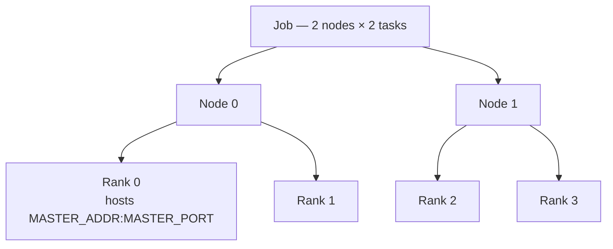

# Synchronizing multiple tasks

This guide runs an applied example in which four tasks, spread across two
nodes, communicate to compute a single result. It shows how a batch script
passes connection information to the tasks through environment variables, and
how each task uses its rank to contribute to a collective sum with PyTorch or
JAX.

## Before you begin

<div class="grid cards" markdown>

-   [:material-lightbulb-alert-outline:{ .lg .middle } __Understanding Slurm__](basics.md)
    { .card }

    ---
    Use an interactive job to run multiple tasks.

-   [:material-monitor-eye:{ .lg .middle } __Monitor and manage jobs__](monitor_manage.md)
    { .card }

    ---
    Track jobs through the queue, inspect and cancel them, and read their
    output.

</div>

## What this guide covers

* Launching multiple tasks across two nodes with `sbatch`
* Passing connection information to tasks through environment variables
* Identifying each task with its rank
* Combining values from all tasks into a single result and reading it from the
  job output

---

## Concept of this example

This example runs four tasks, two on each of two nodes. Each task holds
one number equal to its rank (0, 1, 2 and 3). The tasks add their numbers
together, and only the first task prints the total (6). Reaching a single total
requires the tasks to communicate, which is what this example demonstrates.

The job runs on two nodes and each task is identified by its rank. The
first task (Rank 0) hosts the coordination endpoint `MASTER_ADDR:MASTER_PORT`
that the other tasks connect to:



This example launches a job (using `job_***.sh`) that runs one or more tasks
(whose instructions are stored in `main_jax.py` or `main_torch.py`) using
libraries (defined in `pyproject.toml`).

Each example is based on three files:

| File | Description |
| ---- | ----------- |
| `job_***.sh` | Bash script used to request an allocation and launch a job (which itself runs multiple tasks based on the requested `--nodes` and `--ntasks-per-node`) |
| `main_***.py` | Python script containing the instructions the tasks execute. This example uses either JAX (with the script `main_jax.py`) or PyTorch (with the script `main_torch.py`) |
| `pyproject.toml` | Configuration file used to handle the libraries `uv` fetches. A separate `pyproject.toml` could be used for each example (JAX and PyTorch), but both libraries are gathered in one to simplify this guide |


### Introducing the different files

=== "job_torch.sh"
    ```bash
    #!/bin/bash
    #SBATCH --nodes=2
    #SBATCH --ntasks-per-node=2
    #SBATCH --cpus-per-task=1
    #SBATCH --mem=8G
    #SBATCH --time=00:01:00

    # These environment variables are read by the distributed runtime and
    # should ideally be set before running the python script, or at the very
    # beginning of the python script.

    # Master address is the hostname of the first node in the job.
    export MASTER_ADDR=$(scontrol show hostnames "$SLURM_JOB_NODELIST" \
         | head -n 1)
    # Derive a per-job port from the last 4 digits of the job ID
    export MASTER_PORT=$(expr 10000 + $(echo -n $SLURM_JOB_ID | tail -c 4))
    export WORLD_SIZE=$SLURM_NTASKS

    srun uv run python main_torch.py
    ```

=== "job_jax.sh"
    ```bash
    #!/bin/bash
    #SBATCH --nodes=2
    #SBATCH --ntasks-per-node=2
    #SBATCH --cpus-per-task=1
    #SBATCH --mem=8G
    #SBATCH --time=00:01:00

    # These environment variables are read by the distributed runtime and
    # should ideally be set before running the python script, or at the very
    # beginning of the python script.

    # Master address is the hostname of the first node in the job.
    export MASTER_ADDR=$(scontrol show hostnames "$SLURM_JOB_NODELIST" \
         | head -n 1)
    # Derive a per-job port from the last 4 digits of the job ID
    export MASTER_PORT=$(expr 10000 + $(echo -n $SLURM_JOB_ID | tail -c 4))
    export WORLD_SIZE=$SLURM_NTASKS

    srun uv run python main_jax.py
    ```

??? info "In-depth script explanation on `job_***.sh`"
    **Headers for the resources allocation**

    The `#SBATCH` header lines request the resource allocation: 2 nodes with 2
    tasks each (4 tasks in total), 1 CPU per task, 8G of memory and a 1-minute
    time limit. `--ntasks-per-node` fixes the number of tasks on each node, the
    safe form for distributed jobs (see
    [Understanding Slurm](basics.md#inspect-where-tasks-run)).

    **Environment variables**

    The environment variables `MASTER_ADDR`, `MASTER_PORT` and `WORLD_SIZE` are
    defined here and can be retrieved in each task. `MASTER_PORT` derives a
    per-job port from the last 4 digits of the job ID (a value in the 10000 to
    19999 range), so that jobs running at the same time do not collide on the
    same port. `$SLURM_NTASKS` holds the total number of tasks (nodes × tasks
    per node), so `WORLD_SIZE=$SLURM_NTASKS` counts all 4 tasks. In Python,
    retrieve an environment variable value as follows:
    ```python
    import os # Retrieving an environment variable is done through os.environ

    MASTER_ADDR = os.environ["MASTER_ADDR"]
    ```


    **Running the tasks**

    `srun uv run python main_***.py`

    * The command `srun` creates tasks. The number of tasks is determined by
      the allocation — here, 2 nodes × 2 tasks per node, so
      the command runs 4 tasks in parallel. These tasks run the command
      following `srun`, so each task runs `uv run python main_torch.py` or `uv
      run python main_jax.py`.
    * `uv run` sets up the environment for the tasks. For more
      information, read the [`uv` guide on portability](../python_uv.md). It is
      followed by the name of the script to run in this environment.


=== "main_torch.py"
    ```python
    import os

    import torch
    import torch.distributed

    RANK = int(os.environ["SLURM_PROCID"])
    LOCAL_RANK = int(os.environ["SLURM_LOCALID"])
    WORLD_SIZE = int(os.environ["SLURM_NTASKS"])
    NODE_INDEX = int(os.environ["SLURM_NODEID"])

    # Defined in the sbatch script, hostname of the first node in the job.
    # export MASTER_ADDR=$(scontrol show hostnames "$SLURM_JOB_NODELIST" | head -n 1)
    MASTER_ADDR = os.environ.get("MASTER_ADDR")
    # Get a unique port for this job based on the job ID
    MASTER_PORT = os.environ.get("MASTER_PORT")


    def main():

        torch.distributed.init_process_group(
            init_method=f"tcp://{MASTER_ADDR}:{MASTER_PORT}",
            world_size=WORLD_SIZE,
            rank=RANK,
            backend="gloo" # https://docs.pytorch.org/docs/main/distributed.html#which-backend-to-use
        )

        x = torch.tensor([float(RANK)], dtype=torch.float32)
        print(f"\n[Node {NODE_INDEX} | Rank {RANK}] x={x[0]}")

        total = torch.clone(x)
        torch.distributed.reduce(
            total, dst=0, op=torch.distributed.ReduceOp.SUM
        )

        if NODE_INDEX == 0 and RANK == 0: # The complete sum lands on the first task of the first node
            print(f"sum={total[0]}")
        torch.distributed.destroy_process_group()


    if __name__ == "__main__":
        main()
    ```

=== "main_jax.py"
    ```python
    import os

    import jax
    import jax.distributed
    from jax.sharding import NamedSharding, PartitionSpec as P

    RANK = int(os.environ["SLURM_PROCID"])
    LOCAL_RANK = int(os.environ["SLURM_LOCALID"])
    WORLD_SIZE = int(os.environ["SLURM_NTASKS"])
    NODE_INDEX = int(os.environ["SLURM_NODEID"])

    def main():
        jax.config.update("jax_platforms", "cpu")
        jax.distributed.initialize() # Connect the tasks together, must be called before performing any JAX computations

        # One mesh axis named "i" spanning all the tasks
        mesh = jax.make_mesh((WORLD_SIZE,), ("i",))

        x = jax.numpy.array([float(RANK)], dtype=jax.numpy.float32) # For each task, x depends on RANK, which is different between all tasks
        print(f"\n[Node {NODE_INDEX} | Rank {RANK}] x={x[0]}")

        # Assemble the per-task values into one global array sharded on axis "i"
        global_x = jax.make_array_from_process_local_data(NamedSharding(mesh, P("i")), x)

        # Sum x across all tasks.
        total = jax.jit(
            jax.shard_map(lambda v: jax.lax.psum(v, "i"), mesh=mesh, in_specs=P("i"), out_specs=P())
        )(global_x)
        if NODE_INDEX == 0 and RANK == 0:
            print(f"sum={total[0]}")


    if __name__ == "__main__":
        main()
    ```

??? info "In-depth script explanation on `main_***.py`"
    **PyTorch and JAX**

    This guide is based on two open source examples

    * [PyTorch](https://pytorch.org/) is a deep-learning library.
    * [JAX](https://docs.jax.dev/en/latest/notebooks/thinking_in_jax.html) is a
      library for array-oriented numerical computation.

    **Environment variables**

    Each file retrieves the Slurm environment variables `SLURM_PROCID`,
    `SLURM_NTASKS` and `SLURM_NODEID`. Unlike the environment variables defined
    previously (`MASTER_ADDR`, `MASTER_PORT` and `WORLD_SIZE`), these
    environment variables are specific to each task. More common Slurm
    environment variables are listed in [the technical
    reference](../../technical_reference/general_theory/slurm.md).

    ```python
    RANK = int(os.environ["SLURM_PROCID"])
    LOCAL_RANK = int(os.environ["SLURM_LOCALID"])
    WORLD_SIZE = int(os.environ["SLURM_NTASKS"])
    NODE_INDEX = int(os.environ["SLURM_NODEID"])
    ```

    === "What happens in the PyTorch script"
        1. Initialize: in PyTorch, a group is defined
        2. Create a value, different for each task

            The created value is based on the RANK, which is specific to each
            task

        3. Compute their sum

    === "What happens in the JAX script"
        1. Initialize: connect the tasks together, then build a device mesh
           with one named axis `i` spanning all the tasks
        2. Create a value, different for each task

            The created value is based on the RANK, which is specific to each
            task. `jax.make_array_from_process_local_data` then assembles the
            per-task values into one global array sharded along the axis `i`.

        3. Compute their sum with `jax.lax.psum` inside `jax.shard_map` [see
           the shard_map
           guide](https://docs.jax.dev/en/latest/notebooks/shard_map.html)

    The final sum is printed from the first task of the first node (NODE_INDEX=0
    and RANK=0). This is the task where all the `x` values have been collected.
    On the other tasks, `total` holds a partial result.


=== "pyproject.toml (for PyTorch)"
    ```toml
    [project]
    name = "multitasks-demo"
    version = "0.1.0"
    description = "Using Jax and Torch to illustrate a multitask example"
    requires-python = ">=3.11,<3.14"
    dependencies = ["torch>=2.7.1"]
    ```

=== "pyproject.toml (for JAX)"
    ```toml
    [project]
    name = "multitasks-demo"
    version = "0.1.0"
    description = "Using Jax and Torch to illustrate a multitask example"
    requires-python = ">=3.11,<3.14"
    dependencies = ["jax>=0.7"]
    ```


??? info "In-depth explanation on `pyproject.toml`"
    `pyproject.toml` is a configuration file used by packaging tools (`uv` in
    this case) ([More info on `pyproject.toml`
    files](https://packaging.python.org/en/latest/guides/writing-pyproject-toml/)).
    The value of dependencies contains information about the libraries used in
    this example. `torch` is used with the `main_torch.py` script, and `jax`
    with the `main_jax.py` script. To use only one of them, delete the unused
    library from the `pyproject.toml` file.

### Launching the example

1. Create the three files on the cluster

    === "VSCode"

        Open the project on a compute node with `mila code`, or pick `mila-cpu`
        in the Remote-SSH dropdown, then create `job_***.sh`, `main_***.py` and
        `pyproject.toml` in the VSCode explorer. See
        [VSCode](../../toolbox/VSCode.md) and the [Get Started
        guide](../../getting_started/index.md).

    === "Terminal"

        Connect to the cluster with `ssh mila`, then create the files in
        `$SCRATCH` with an editor such as `vim`.

        ```bash
        ssh mila
        ```

2. Launch the job

    In the VSCode integrated terminal (or a login-node terminal), submit the
    job:

    === "Launch PyTorch example"

        ```bash
        sbatch job_torch.sh
        ```

    === "Launch JAX example"

        ```bash
        sbatch job_jax.sh
        ```


3. (Optional) Check the job status

    ```bash
    squeue --me
    ```

    See [Monitor and manage jobs](monitor_manage.md) for how to read the
    output, inspect the job once it finishes, and cancel it if needed.

4. Retrieve the results

    Once the job has run, its output is available in the file
    `slurm-<JOB_ID>.out` by default, where `<JOB_ID>` is the ID of the job.

    === "PyTorch script results"

        <div class="result" style="border:None; padding:0" markdown>
        ``` linenums="0"
        [Node 0 | Rank 0] x=0.0
        sum=6.0
        [Node 0 | Rank 1] x=1.0
        [Node 1 | Rank 3] x=3.0
        [Node 1 | Rank 2] x=2.0
        ```
        </div>

    === "JAX script results"

        <div class="result" style="border:None; padding:0" markdown>
        ``` linenums="0"
        [Node 1 | Rank 2] x=2.0
        [Node 0 | Rank 1] x=1.0
        [Node 1 | Rank 3] x=3.0
        [Node 0 | Rank 0] x=0.0
        sum=6.0
        ```
        </div>

    For each example, the ranks of the tasks (that is, their `x` values) are
    respectively 0, 1, 2 and 3. Their sum is collected on [Node 0 | Rank 0],
    which prints `sum=6.0`:

    ```mermaid
    graph LR
        R0["Node 0 | Rank 0<br>x=0.0"] --> S["SUM"]
        R1["Node 0 | Rank 1<br>x=1.0"] --> S
        R2["Node 1 | Rank 2<br>x=2.0"] --> S
        R3["Node 1 | Rank 3<br>x=3.0"] --> S
        S --> P["Node 0 | Rank 0<br>prints sum=6.0"]
    ```

---

## Key concepts

Rank
:   The unique index of a task within the job, from 0 to the number of tasks
    minus 1. Read from `$SLURM_PROCID` in this example.

World size
:   The total number of tasks taking part in the communication, read from
    `$SLURM_NTASKS`.

`MASTER_ADDR` / `MASTER_PORT`
:   The hostname of the job's first node and a per-job port, exported by the
    batch script so that every task connects to the same coordination
    endpoint.

## Next step

<div class="grid cards" markdown>

-   [:material-multicast:{ .lg .middle } __Launch many jobs from the same shell script__](../../examples/good_practices/launch_many_jobs/index.md)
    { .card }

    ---
    Good practice to run the same experiment with different arguments.

&nbsp;

</div>
