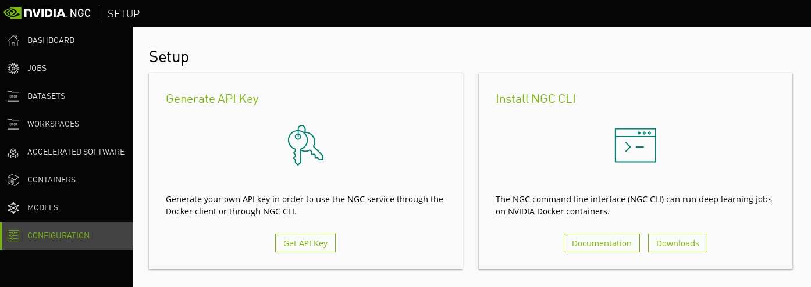

.. _nvidia:

Containers from Nvidia cloud
^^^^^^^^^^^^^^^^^^^^^^^^^^^^

One advantage of pulling containers from nvidia cloud is that nvidia software such as Apex or Dali are already installed on them.
In order to get those containers, you need to register on `ngc`_. After you log in, go on configuration and Generate an API Key.

.. _ngc: https://ngc.nvidia.com/signup

Once you get your API key, you need to add them into your bashrc:

.. prompt:: bash $

        echo "export SINGULARITY_DOCKER_USERNAME='$oauthtoken'" >> ~/.bashrc
        echo "export SINGULARITY_DOCKER_PASSWORD=YOUR_API_KEY_HERE" >> ~/.bashrc

Then you can pull the container you want from the `nvidia page`_. For example to get pytorch:

.. _nvidia page: https://ngc.nvidia.com/catalog/containers?orderBy=&query=&quickFilter=deep-learning

.. prompt:: bash $

        singularity pull docker://nvcr.io/nvidia/pytorch:19.02-py3

or if you want tensorflow:

.. prompt:: bash $

        singularity pull docker://nvcr.io/nvidia/tensorflow:19.02-py3

.. warning:: Don't pull pytorch:19.03 or tensorflow:19.03, they require CUDA 10.1 and nvidia driver 418+ that are not yet installed on the clusters. Please refer to the release Notes on `nvidia doc`_

.. _nvidia doc: https://docs.nvidia.com/deeplearning/dgx/index.html

